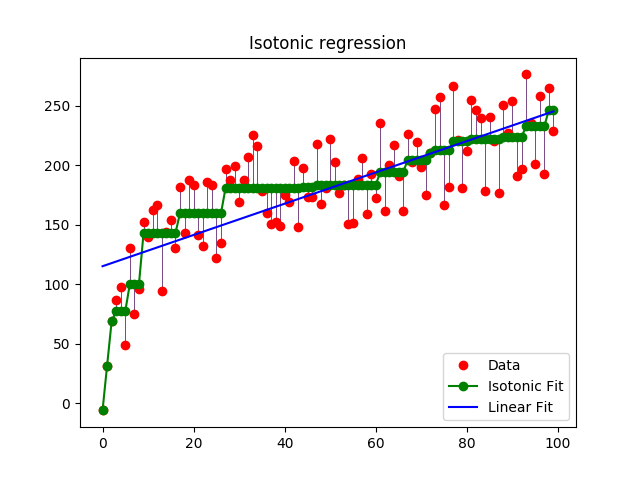

# 1.15\. 等式回归

校验者:
        [@STAN,废柴0.1](https://github.com/apachecn/scikit-learn-doc-zh)
翻译者:
        [@Damon](https://github.com/apachecn/scikit-learn-doc-zh)

[`IsotonicRegression`](generated/sklearn.isotonic.IsotonicRegression.html#sklearn.isotonic.IsotonicRegression "sklearn.isotonic.IsotonicRegression") 类对数据进行非降函数拟合. 它解决了如下的问题:

> 最小化 
> 
> 服从于 

其中每一个  是 strictly 正数而且每个  是任意实 数. 它生成一个由平方误差接近的不减元素组成的向量.实际上这一些元素形成 一个分段线性的函数.

