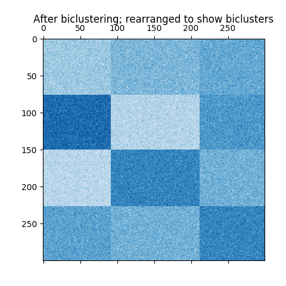

# 2.4\. 双聚类

校验者:
        [@udy](https://github.com/apachecn/scikit-learn-doc-zh)
翻译者:
        [@程威](https://github.com/apachecn/scikit-learn-doc-zh)

Biclustering 可以使用 [`sklearn.cluster.bicluster`](classes.html#module-sklearn.cluster.bicluster "sklearn.cluster.bicluster") 模块。 Biclustering 算法对数据矩阵的行列同时进行聚类。 同时对行列进行聚类称之为 biclusters。 每一次聚类都会通过原始数据矩阵的一些属性确定一个子矩阵。

例如, 一个矩阵 `(10, 10)` , 一个 bicluster 聚类，有三列二行，就是一个子矩阵 `(3, 2)`

```py
>>> import numpy as np
>>> data = np.arange(100).reshape(10, 10)
>>> rows = np.array([0, 2, 3])[:, np.newaxis]
>>> columns = np.array([1, 2])
>>> data[rows, columns]
array([[ 1,  2],
 [21, 22],
 [31, 32]])

```

为了可视化， 给定一个 bicluster 聚类，数据矩阵的行列可以重新分配，使得 bi-cluster 是连续的。

算法在如何定义 bicluster 方面有一些不同，常见类型包括：

*   不变的 values , 不变的 rows, 或者不变的 columns。
*   异常高的或者低的值。
*   低方差的子矩阵。
*   相关的 rows 或者 columns。

算法在分配给 bicluster 行列的方式不同, 会导致不同的 bicluster 结构。 当行和列分成分区时，会发生对角线或者棋盘结构。

如果每一行和每一列同属于一种 bicluster ,就重新排列数据矩阵的行和列,会使得 bicluster 呈现对角线。 下面是一个例子，此结构的biclusters 具有比其他行列更高的平均值:

[](../auto_examples/bicluster/images/sphx_glr_plot_spectral_coclustering_003.png)

在棋盘结构的例子中, 每一行属于所有的列类别, 每一列属于所有的行类别。 下面是一个例子，每个 bicluster 中的值差异较小:

[](../auto_examples/bicluster/images/sphx_glr_plot_spectral_biclustering_003.png)

在拟合模型之后， 可以在 `rows_` 和 `columns_` 属性中找到行列 cluster membership 。 `rows_[i]` 是一个二进制的向量， 就是属于 bicluster `i` 的一行。 同样的, `columns_[i]` 就表示属于 bicluster `i` 的列。

一些模块也有 `row_labels_` 何 `column_labels_` 属性。 这些模块对行列进行分区, 例如对角线或者棋盘 bicluster 结构。

Note

Biclustering 在不同的领域有很多其他名称，包括 co-clustering, two-mode clustering, two-way clustering, block clustering, coupled two-way clustering 等.有一些算法的名称，比如 Spectral Co-Clustering algorithm, 反应了这些备用名称。

## 2.4.1\. Spectral Co-Clustering

> [`SpectralCoclustering`](generated/sklearn.cluster.bicluster.SpectralCoclustering.html#sklearn.cluster.bicluster.SpectralCoclustering "sklearn.cluster.bicluster.SpectralCoclustering") 算法找到的 bicluster 的值比相应的其他行和列更高。

每一个行和列都只属于一个 bicluster, 所以重新分配行和列，使得分区连续显示对角线上的 high value:

Note

算法将输入的数据矩阵看做成二分图：该矩阵的行和列对应于两组顶点，每个条目对应于行和列之间的边，该算法近似的进行归一化，对图进行切割，找到更重的子图。

### 2.4.1.1\. 数学公式

找到最优归一化剪切的近似解，可以通过图形的 Laplacian 的广义特征值分解。 通常这意味着直接使用 Laplacian 矩阵. 如果原始数据矩阵  有形状 , 则对应的 bipartite 图的 Laplacian 矩阵具有形状 。 但是, 在这种情况直接使用  , 因为它更小，更有作用。

输入矩阵  被预处理如下:

```py


```

 是  对角线矩阵，和  相同，  是  的对角吸纳矩阵，等同于 。

奇异值分解,  , 提供了  行列的分区. 左边的奇异值向量给予行分区，右边的奇异值向量给予列分区。

 奇异值向量从第二个开始, 提供所需的分区信息。 这些用于形成矩阵 :&lt;cite&gt;Z&lt;/cite&gt;:

```py


```

 的列是 , 和  相似 。

然后  的 rows 通过使用 [k-means](clustering.html#k-means) 进行聚类. `n_rows` 标签提供行分区, 剩下的 `n_columns` 标签 提供 列分区。

例子:

*   [A demo of the Spectral Co-Clustering algorithm](../auto_examples/bicluster/plot_spectral_coclustering.html#sphx-glr-auto-examples-bicluster-plot-spectral-coclustering-py): 如何用 bicluster 数据矩阵并应用。
*   [Biclustering documents with the Spectral Co-clustering algorithm](../auto_examples/bicluster/plot_bicluster_newsgroups.html#sphx-glr-auto-examples-bicluster-plot-bicluster-newsgroups-py):一个在 20 个新闻组数据集中发现 biclusters 的例子

参考文献:

*   Dhillon, Inderjit S, 2001\. [Co-clustering documents and words using bipartite spectral graph partitioning](http://citeseerx.ist.psu.edu/viewdoc/summary?doi=10.1.1.140.3011).

## 2.4.2\. Spectral Biclustering

> [`SpectralBiclustering`](generated/sklearn.cluster.bicluster.SpectralBiclustering.html#sklearn.cluster.bicluster.SpectralBiclustering "sklearn.cluster.bicluster.SpectralBiclustering") 算法假设输入的数据矩阵具有隐藏的棋盘结构。 具有这种结构的矩阵的行列 可能被分区，使得在笛卡尔积中的 大部分 biclusters 的 row clusters 和 column cluster 是近似恒定的。

例如，如果有两个row 分区和三个列分区，每一行属于三个 bicluster ，每一列属于两个 bicluster。

这个算法划分矩阵的行和列，以至于提供一个相应的块状不变的棋盘矩阵，近似于原始矩阵。

### 2.4.2.1\. 数学表示

输入矩阵  先归一化，使得棋盘模式更明显。有三种方法:

1.  _独立的行和列归一化_, as in Spectral Co-Clustering. 这个方法使得行和一个常数相加，列和变量相加。
2.  **Bistochastization**: 重复行和列归一化直到收敛。该方法使得行和列都相加

   相同的常数。

1.  **Log 归一化**: 计算数据矩阵的对数 . 列就是 , 行就是 , 总体上来看  of  被计算的. 最后矩阵通过下面的公式计算

```py


```

归一化后，首先少量的奇异值向量被计算，只是在 Spectral Co-Clustering 算法中。

如果使用 log 归一化，则所有的奇异向量都是有意义的。但是, 如果是独立的归一化或双曲线化 被使用，第一个奇异矢量,  和 。 会被丢弃。 从现在开始, “first” 奇异值向量与  和  相关，除了日志归一化的情况。

给定这些奇异值向量， 将他们排序，通过分段常数向量保证最佳近似。 使用一维 k-means 找到每个向量的近似值 并使用欧几里得距离得分。 Some subset of 最好的左右奇异值向量的子集被选择。 下一步, 数据预计到这个最佳子集的奇异向量和聚类。

例如，如果  奇异值向量被计算，最好按照描述找到  ， 其中 。  列为，the  最佳左奇异向量的矩阵, 并且  对于右边是类似的. 要划分行, 将  的 投影到  维空间: 。  行  矩阵的行作为采样和使用 k-means 的聚类处理产生行标签。 类似地，将列投影到  ，并且对  矩阵进行聚类得到列标签。

示例:

*   [A demo of the Spectral Biclustering algorithm](../auto_examples/bicluster/plot_spectral_biclustering.html#sphx-glr-auto-examples-bicluster-plot-spectral-biclustering-py): 一个简单的例子 显示如何生成棋盘矩阵和 bicluster

.

参考文献:

*   Kluger, Yuval, et. al., 2003\. [Spectral biclustering of microarray data: coclustering genes and conditions](http://citeseerx.ist.psu.edu/viewdoc/summary?doi=10.1.1.135.1608).

## 2.4.3\. Biclustering 评测

有两种评估双组分结果的方法：内部和外部。 诸如群集稳定性等内部措施只依赖于数据和结果本身。 目前在scikit-learn中没有内部的二集群措施。外部措施是指外部信息来源，例如真正的解决方案。 当使用真实数据时，真正的解决方案通常是未知的，但是，由于真正的解决方案是已知的，因此人造数据的双重分析可能对于评估算法非常有用。

为了将一组已发现的双组分与一组真正的双组分进行比较， 需要两个相似性度量：单个双色团体的相似性度量，以及将这些个体相似度结合到总分中的方法。

为了比较单个双核，已经采用了几种措施。现在，只有Jaccard索引被实现：

```py


```

```py
 和  是 biclusters,  是交叉点的元素的数量。
```

Jaccard 索引 达到最小值0，当 biclusters 不重叠的时候，并且当他们相同干的时候，最大值为1。

有些方法已经开发出来，用来比较两个 biclusters 的数据集。 从现在开始 之后 [`consensus_score`](generated/sklearn.metrics.consensus_score.html#sklearn.metrics.consensus_score "sklearn.metrics.consensus_score") (Hochreiter et. al., 2010) 是可以用:

1.  使用 Jaccard 索引或类似措施，计算 biclusters 的 bicluster 相似性。
2.  以一对一的方式将 bicluster 分从一组分配给另一组，以最大化其相似性的总和。该步骤使用匈牙利算法执行。
3.  相似性的最终总和除以较大集合的大小。

最小共识得分为0，发生在所有 biclusters 完全不相似时。当两组 biclusters 相同时，最大分数为1。

参考文献:

*   Hochreiter, Bodenhofer, et. al., 2010\. [FABIA: factor analysis for bicluster acquisition](https://www.ncbi.nlm.nih.gov/pmc/articles/PMC2881408/).