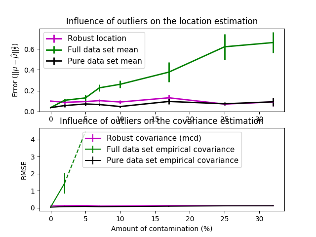

# 2.10\. Robust 协方差估计

实际数据集通常是会有测量或记录错误。合格但不常见的观察也可能出于各种原因。 每个不常见的观察称为异常值。 上面提出的经验协方差估计器和收缩协方差估计器对数据中异常观察值非常敏感。 因此，应该使用更好的协方差估计（robust covariance estimators）来估算其真实数据集的协方差。 或者，可以使用更好的协方差估计器（robust covariance estimators）来执行异常值检测， 并根据数据的进一步处理，丢弃/降低某些观察值。

`sklearn.covariance` 包实现了 robust estimator of covariance， 即 Minimum Covariance Determinant [[3]](#id14) 。

## 2.10.1\. 最小协方差决定

最小协方差决定（Minimum Covariance Determinant）估计器是 由 P.J. Rousseeuw 在 [[3]](#id14) 中引入的数据集协方差的鲁棒估计 (robust estimator)。 这个想法是找出一个给定比例（h）的 “好” 观察值，它们不是离群值， 且可以计算其经验协方差矩阵。 然后将该经验协方差矩阵重新缩放以补偿所执行的观察选择（”consistency step(一致性步骤)”）。 计算最小协方差决定估计器后，可以根据其马氏距离（Mahalanobis distance）给出观测值的权重， 这导致数据集的协方差矩阵的重新加权估计（”reweighting step(重新加权步骤)”）。

Rousseeuw 和 Van Driessen [[4]](#id15) 开发了 FastMCD 算法，以计算最小协方差决定因子（Minimum Covariance Determinant）。 在 scikit-learn 中，该算法在将 MCD 对象拟合到数据时应用。FastMCD 算法同时计算数据集位置的鲁棒估计。

Raw估计可通过 [`MinCovDet`](generated/sklearn.covariance.MinCovDet.html#sklearn.covariance.MinCovDet "sklearn.covariance.MinCovDet") 对象的 `raw_location_` 和 `raw_covariance_` 属性获得。

参考文献:

| [3] | _([1](#id10), [2](#id12))_ P. J. Rousseeuw. Least median of squares regression. J. Am Stat Ass, 79:871, 1984. |

| [[4]](#id13) | A Fast Algorithm for the Minimum Covariance Determinant Estimator, 1999, American Statistical Association and the American Society for Quality, TECHNOMETRICS. |

例子:

*   See [Robust vs Empirical covariance estimate](../auto_examples/covariance/plot_robust_vs_empirical_covariance.html#sphx-glr-auto-examples-covariance-plot-robust-vs-empirical-covariance-py) 关于如何将对象 [`MinCovDet`](generated/sklearn.covariance.MinCovDet.html#sklearn.covariance.MinCovDet "sklearn.covariance.MinCovDet") 与数据拟合的示例， 尽管存在异常值，但估计结果仍然比较准确。
*   See [Robust covariance estimation and Mahalanobis distances relevance](../auto_examples/covariance/plot_mahalanobis_distances.html#sphx-glr-auto-examples-covariance-plot-mahalanobis-distances-py) 马氏距离（Mahalanobis distance），针对协方差估计器 [`EmpiricalCovariance`](generated/sklearn.covariance.EmpiricalCovariance.html#sklearn.covariance.EmpiricalCovariance "sklearn.covariance.EmpiricalCovariance") 和 [`MinCovDet`](generated/sklearn.covariance.MinCovDet.html#sklearn.covariance.MinCovDet "sklearn.covariance.MinCovDet") 之间的差异进行可视化。（所以我们得到了精度矩阵的更好估计）

| Influence of outliers on location and covariance estimates | Separating inliers from outliers using a Mahalanobis distance |
| --- | --- |
|  |  |