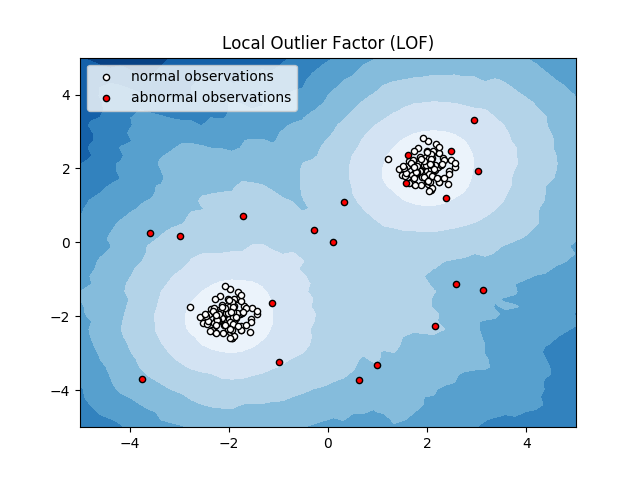
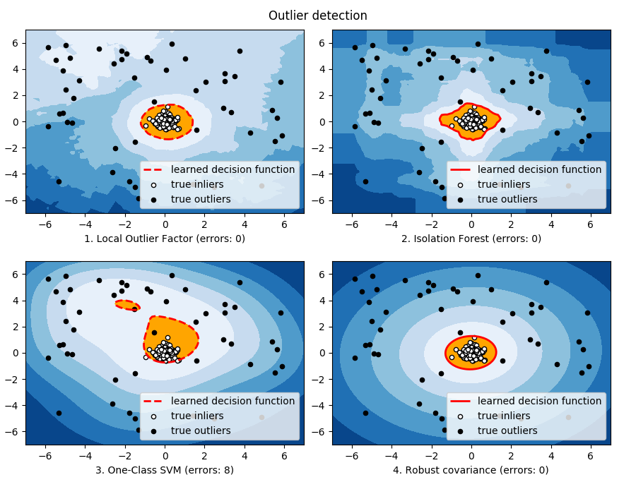
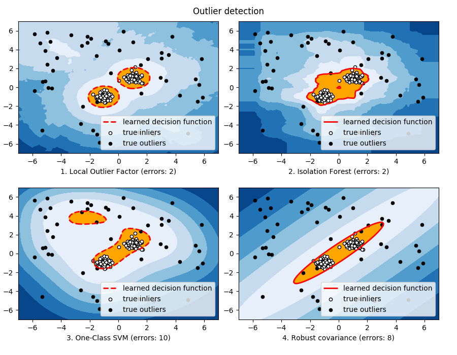
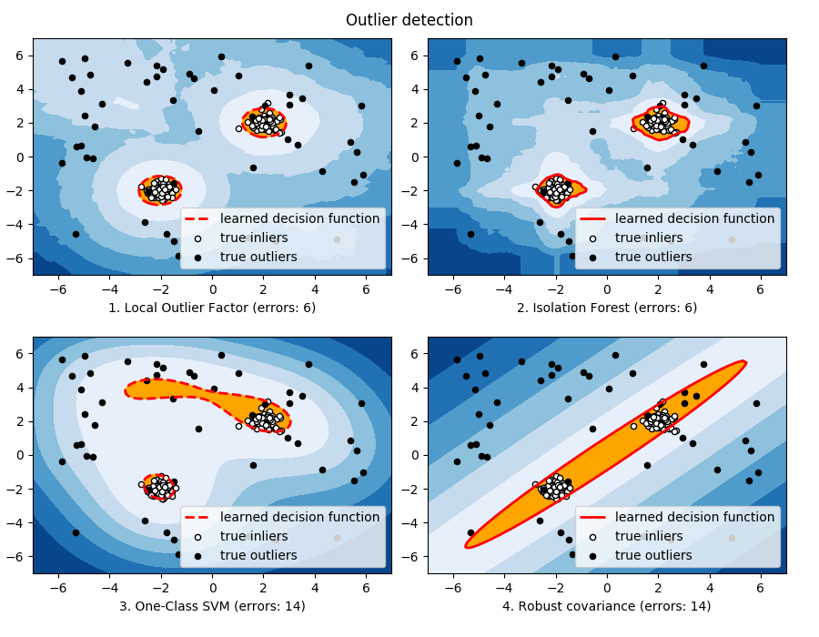

# 2.11\. 新奇和异常值检测

校验者:
        [@RyanZhiNie](https://github.com/RyanZhiNie)
        [@羊三](https://github.com/apachecn/scikit-learn-doc-zh)
翻译者:
        [@羊三](https://github.com/apachecn/scikit-learn-doc-zh)

许多应用需要能够对新观测进行判断，判断其是否与现有观测服从同一分布（即新观测为内围值），相反则被认为不服从同一分布（即新观测为异常值）。 通常，这种能力被用于清理实际的数据集。必须做出两种重要区分：


| 新奇检测: | 训练数据未被异常值污染，我们对于新观测中的异常情况有兴趣检测。 |
| --- | --- |
| 异常值检测: | 训练数据包含异常值，我们需要拟合出训练数据的中心模式，以忽略有偏差的观测。 |
| --- | --- |

scikit-learn项目提供了一套可用于新奇或异常值检测的机器学习工具。 该策略是以无监督的方式学习数据中的对象来实现的:

```py
estimator.fit(X_train)

```

然后可以使用 &lt;cite&gt;predict&lt;/cite&gt; 方法将新观测归为内围值或异常值:

```py
estimator.predict(X_test)

```

内围值被标记为1，而异常值被标记为-1。

## 2.11.1\. Novelty Detection（新奇检测）

考虑一个来自同一分布的数据集，以  个特征描述、有  个观测。 现在考虑我们再往该数据集中添加一个观测。 如果新观测与原有观测有很大差异，我们就可以怀疑它是否是内围值吗？ （即是否来自同一分布？）或者相反，如果新观测与原有观测很相似，我们就无法将其与原有观测区分开吗？ 这就是新奇检测工具和方法所解决的问题。

一般来说，它将要学习出一个粗略且紧密的边界，界定出初始观测分布的轮廓，绘制在相互嵌入的  维空间中。 那么，如果后续的观测在边界划分的子空间内，则它们被认为来自与初始观测相同的总体。 否则，如果它们在边界之外，我们可以说就我们评估中给定的置信度而言，它们是异常值。

One-Class SVM（一类支持向量机）已经由 Schölkopf 等人采用以实现新奇检测，并在 [支持向量机](svm.html#svm) 模块的 [`svm.OneClassSVM`](generated/sklearn.svm.OneClassSVM.html#sklearn.svm.OneClassSVM "sklearn.svm.OneClassSVM") 对象中实现。 需要选择 kernel 和 scalar 参数来定义边界。 通常选择 RBF kernel，即使没有确切的公式或算法来设置其带宽参数。 这是 scikit-learn 实现中的默认值。  参数，也称为一类支持向量机的边沿，对应于在边界之外找到新的但内围的观测的概率。

参考文献:

*   [Estimating the support of a high-dimensional distribution](http://dl.acm.org/citation.cfm?id=1119749) Schölkopf, Bernhard, et al. Neural computation 13.7 (2001): 1443-1471.

例子:

*   参见 [One-class SVM with non-linear kernel (RBF)](../auto_examples/svm/plot_oneclass.html#sphx-glr-auto-examples-svm-plot-oneclass-py) ，通过 [`svm.OneClassSVM`](generated/sklearn.svm.OneClassSVM.html#sklearn.svm.OneClassSVM "sklearn.svm.OneClassSVM") 对象学习一些数据来将边界可视化。

[](../auto_examples/svm/plot_oneclass.html)

## 2.11.2\. Outlier Detection（异常值检测）

异常值检测类似于新奇检测，其目的是将内围观测的中心与一些被称为 “异常值” 的污染数据进行分离。 然而，在异常值检测的情况下，我们没有干净且适用于训练任何工具的数据集来代表内围观测的总体。

### 2.11.2.1\. Fitting an elliptic envelope（椭圆模型拟合）

实现异常值检测的一种常见方式是假设内围数据来自已知分布（例如，数据服从高斯分布）。 从这个假设来看，我们通常试图定义数据的 “形状”，并且可以将异常观测定义为足够远离拟合形状的观测。

scikit-learn 提供了 [`covariance.EllipticEnvelope`](generated/sklearn.covariance.EllipticEnvelope.html#sklearn.covariance.EllipticEnvelope "sklearn.covariance.EllipticEnvelope") 对象，它能拟合出数据的稳健协方差估计，从而为中心数据点拟合出一个椭圆，忽略中心模式之外的点。

例如，假设内围数据服从高斯分布，它将稳健地（即不受异常值的影响）估计内围位置和协方差。 从该估计得到的马氏距离用于得出异常度量。 该策略如下图所示。

[](../auto_examples/covariance/plot_mahalanobis_distances.html)

示例:

*   参见 [Robust covariance estimation and Mahalanobis distances relevance](../auto_examples/covariance/plot_mahalanobis_distances.html#sphx-glr-auto-examples-covariance-plot-mahalanobis-distances-py) 说明对位置和协方差使用标准估计 ([`covariance.EmpiricalCovariance`](generated/sklearn.covariance.EmpiricalCovariance.html#sklearn.covariance.EmpiricalCovariance "sklearn.covariance.EmpiricalCovariance")) 或稳健估计 ([`covariance.MinCovDet`](generated/sklearn.covariance.MinCovDet.html#sklearn.covariance.MinCovDet "sklearn.covariance.MinCovDet")) 来评估观测的异常程度的差异。

参考文献:

*   Rousseeuw, P.J., Van Driessen, K. “A fast algorithm for the minimum covariance determinant estimator” Technometrics 41(3), 212 (1999)

### 2.11.2.2\. Isolation Forest（隔离森林）

```py
在高维数据集中实现异常值检测的一种有效方法是使用随机森林。
```

[`ensemble.IsolationForest`](generated/sklearn.ensemble.IsolationForest.html#sklearn.ensemble.IsolationForest "sklearn.ensemble.IsolationForest") 通过随机选择特征然后随机选择所选特征的最大值和最小值之间的分割值来隔离观测。

由于递归划分可以由树形结构表示，因此隔离样本所需的分割次数等同于从根节点到终止节点的路径长度。

在这样的随机树的森林中取平均的路径长度是数据正态性和我们的决策功能的量度。

随机划分能为异常观测产生明显的较短路径。 因此，当随机树的森林共同为特定样本产生较短的路径长度时，这些样本就很有可能是异常观测。

该策略如下图所示。

[](../auto_examples/ensemble/plot_isolation_forest.html)

例子:

*   参见 [IsolationForest example](../auto_examples/ensemble/plot_isolation_forest.html#sphx-glr-auto-examples-ensemble-plot-isolation-forest-py) 说明隔离森林的用法。
*   参见 [Outlier detection with several methods.](../auto_examples/covariance/plot_outlier_detection.html#sphx-glr-auto-examples-covariance-plot-outlier-detection-py) 比较 [`ensemble.IsolationForest`](generated/sklearn.ensemble.IsolationForest.html#sklearn.ensemble.IsolationForest "sklearn.ensemble.IsolationForest") 与 [`neighbors.LocalOutlierFactor`](generated/sklearn.neighbors.LocalOutlierFactor.html#sklearn.neighbors.LocalOutlierFactor "sklearn.neighbors.LocalOutlierFactor"), [`svm.OneClassSVM`](generated/sklearn.svm.OneClassSVM.html#sklearn.svm.OneClassSVM "sklearn.svm.OneClassSVM") (调整为执行类似异常值检测的方法）和基于协方差使用 [`covariance.EllipticEnvelope`](generated/sklearn.covariance.EllipticEnvelope.html#sklearn.covariance.EllipticEnvelope "sklearn.covariance.EllipticEnvelope") 进行异常值检测。

参考文献:

*   Liu, Fei Tony, Ting, Kai Ming and Zhou, Zhi-Hua. “Isolation forest.” Data Mining, 2008\. ICDM‘08\. Eighth IEEE International Conference on.

### 2.11.2.3\. Local Outlier Factor（局部异常系数）

对中等高维数据集实现异常值检测的另一种有效方法是使用局部异常系数（LOF）算法。

> [`neighbors.LocalOutlierFactor`](generated/sklearn.neighbors.LocalOutlierFactor.html#sklearn.neighbors.LocalOutlierFactor "sklearn.neighbors.LocalOutlierFactor") （LOF）算法计算出反映观测异常程度的得分（称为局部异常系数）。 它测量给定数据点相对于其邻近点的局部密度偏差。 算法思想是检测出具有比其邻近点明显更低密度的样本。

实际上，局部密度从 k 个最近邻得到。 观测数据的 LOF 得分等于其 k 个最近邻的平均局部密度与其本身密度的比值：正常情况预期具有与其近邻类似的局部密度，而异常数据 则预计比局部密度要小得多。

考虑的k个近邻数（别名参数 n_neighbors ）通常选择 1) 大于聚类必须包含的对象最小数量，以便其它对象相对于该聚类成为局部异常值，并且 2) 小于可能成为局部异常值对象的最大数量。 在实践中，这样的信息通常不可用，并且使 n_neighbors = 20 似乎通常都能很好地工作。 当异常值的比例较高时（即大于 10% 时，如下面的例子），n_neighbors 应该较大（在下面的例子中，n_neighbors = 35）。

LOF 算法的优点是考虑到数据集的局部和全局属性：即使在异常样本具有不同潜在密度的数据集中，它也能够表现得很好。 问题不在于样本是如何被分离的，而是样本与周围近邻的分离程度有多大。

该策略如下图所示。

[](../auto_examples/neighbors/plot_lof.html)

示例:

*   参见 [Anomaly detection with Local Outlier Factor (LOF)](../auto_examples/neighbors/plot_lof.html#sphx-glr-auto-examples-neighbors-plot-lof-py) 的 [`neighbors.LocalOutlierFactor`](generated/sklearn.neighbors.LocalOutlierFactor.html#sklearn.neighbors.LocalOutlierFactor "sklearn.neighbors.LocalOutlierFactor") 使用说明。
*   参见 [Outlier detection with several methods.](../auto_examples/covariance/plot_outlier_detection.html#sphx-glr-auto-examples-covariance-plot-outlier-detection-py) 与其它异常检测方法进行比较。

参考文献:

*   Breunig, Kriegel, Ng, and Sander (2000) [LOF: identifying density-based local outliers.](http://www.dbs.ifi.lmu.de/Publikationen/Papers/LOF.pdf) Proc. ACM SIGMOD

### 2.11.2.4\. 一类支持向量机与椭圆模型与隔离森林与局部异常系数

严格来说， One-class SVM （一类支持向量机）不是异常值检测方法，而是一种新奇检测方法：其训练集不应该被异常值污染，因为算法可能将它们拟合。 也就是说，高维度的异常值检测或对数据分布不做任何假设是非常具有挑战性的， 而一类支持向量机在这些情况下产生出有用的结果。

下面的例子说明了当数据越来越不单峰时， [`covariance.EllipticEnvelope`](generated/sklearn.covariance.EllipticEnvelope.html#sklearn.covariance.EllipticEnvelope "sklearn.covariance.EllipticEnvelope") 的表现越来越差。 [`svm.OneClassSVM`](generated/sklearn.svm.OneClassSVM.html#sklearn.svm.OneClassSVM "sklearn.svm.OneClassSVM") 在具有多种模式的数据上表现得更好， [`ensemble.IsolationForest`](generated/sklearn.ensemble.IsolationForest.html#sklearn.ensemble.IsolationForest "sklearn.ensemble.IsolationForest") 和 [`neighbors.LocalOutlierFactor`](generated/sklearn.neighbors.LocalOutlierFactor.html#sklearn.neighbors.LocalOutlierFactor "sklearn.neighbors.LocalOutlierFactor") 在每种情况下都表现良好。

<caption>**Comparing One-class SVM, Isolation Forest, LOF, and Elliptic Envelope**</caption>
| 对于中心化和椭圆形的内围模式， [`svm.OneClassSVM`](generated/sklearn.svm.OneClassSVM.html#sklearn.svm.OneClassSVM "sklearn.svm.OneClassSVM") 不适用于内围总体的旋转对称性。 此外，它拟合了一小部分存在于训练集中的异常值。 相反，基于拟合 [`covariance.EllipticEnvelope`](generated/sklearn.covariance.EllipticEnvelope.html#sklearn.covariance.EllipticEnvelope "sklearn.covariance.EllipticEnvelope") 的决策规则学习出一个椭圆，对于内围分布拟合良好。 [`ensemble.IsolationForest`](generated/sklearn.ensemble.IsolationForest.html#sklearn.ensemble.IsolationForest "sklearn.ensemble.IsolationForest") 和 [`neighbors.LocalOutlierFactor`](generated/sklearn.neighbors.LocalOutlierFactor.html#sklearn.neighbors.LocalOutlierFactor "sklearn.neighbors.LocalOutlierFactor") 也表现良好。 | [](../auto_examples/covariance/plot_outlier_detection.html) |
| 由于内围分布变为双峰，所以 [`covariance.EllipticEnvelope`](generated/sklearn.covariance.EllipticEnvelope.html#sklearn.covariance.EllipticEnvelope "sklearn.covariance.EllipticEnvelope") 对内围数据拟合得不好。 但是，我们可以看到 [`ensemble.IsolationForest`](generated/sklearn.ensemble.IsolationForest.html#sklearn.ensemble.IsolationForest "sklearn.ensemble.IsolationForest"), [`svm.OneClassSVM`](generated/sklearn.svm.OneClassSVM.html#sklearn.svm.OneClassSVM "sklearn.svm.OneClassSVM") 和 [`neighbors.LocalOutlierFactor`](generated/sklearn.neighbors.LocalOutlierFactor.html#sklearn.neighbors.LocalOutlierFactor "sklearn.neighbors.LocalOutlierFactor") 难以检测双峰，而且 [`svm.OneClassSVM`](generated/sklearn.svm.OneClassSVM.html#sklearn.svm.OneClassSVM "sklearn.svm.OneClassSVM") 往往会过拟合：因为它没有内围模型， 便随机地把一些异常值当做内围值聚类在某个区域。 | [](../auto_examples/covariance/plot_outlier_detection.html) |
| 如果内围分布极度不正态，则 [`svm.OneClassSVM`](generated/sklearn.svm.OneClassSVM.html#sklearn.svm.OneClassSVM "sklearn.svm.OneClassSVM"), [`ensemble.IsolationForest`](generated/sklearn.ensemble.IsolationForest.html#sklearn.ensemble.IsolationForest "sklearn.ensemble.IsolationForest") 和 [`neighbors.LocalOutlierFactor`](generated/sklearn.neighbors.LocalOutlierFactor.html#sklearn.neighbors.LocalOutlierFactor "sklearn.neighbors.LocalOutlierFactor") 能构造出合理的近似结果, 而 [`covariance.EllipticEnvelope`](generated/sklearn.covariance.EllipticEnvelope.html#sklearn.covariance.EllipticEnvelope "sklearn.covariance.EllipticEnvelope") 完全失败。 | [](../auto_examples/covariance/plot_outlier_detection.html) |

示例:

*   参见 [Outlier detection with several methods.](../auto_examples/covariance/plot_outlier_detection.html#sphx-glr-auto-examples-covariance-plot-outlier-detection-py) 比较 [`svm.OneClassSVM`](generated/sklearn.svm.OneClassSVM.html#sklearn.svm.OneClassSVM "sklearn.svm.OneClassSVM") (调整为执行类似异常值检测的方法）, [`ensemble.IsolationForest`](generated/sklearn.ensemble.IsolationForest.html#sklearn.ensemble.IsolationForest "sklearn.ensemble.IsolationForest"), [`neighbors.LocalOutlierFactor`](generated/sklearn.neighbors.LocalOutlierFactor.html#sklearn.neighbors.LocalOutlierFactor "sklearn.neighbors.LocalOutlierFactor") 和基于协方差使用 [`covariance.EllipticEnvelope`](generated/sklearn.covariance.EllipticEnvelope.html#sklearn.covariance.EllipticEnvelope "sklearn.covariance.EllipticEnvelope") 进行异常值检测。