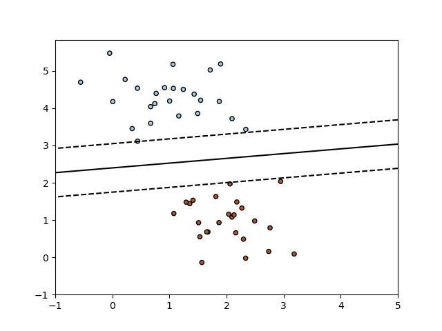
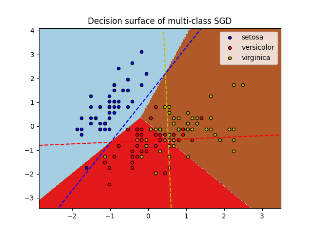
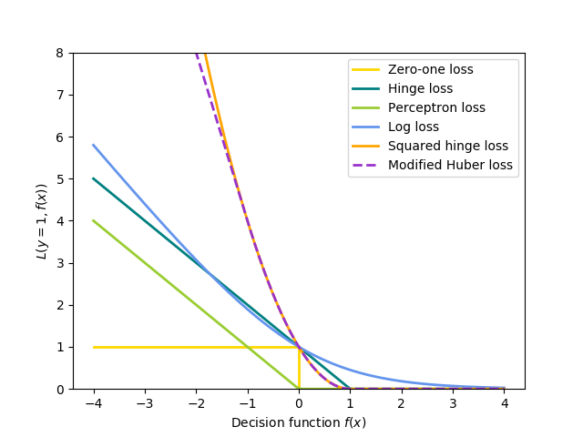
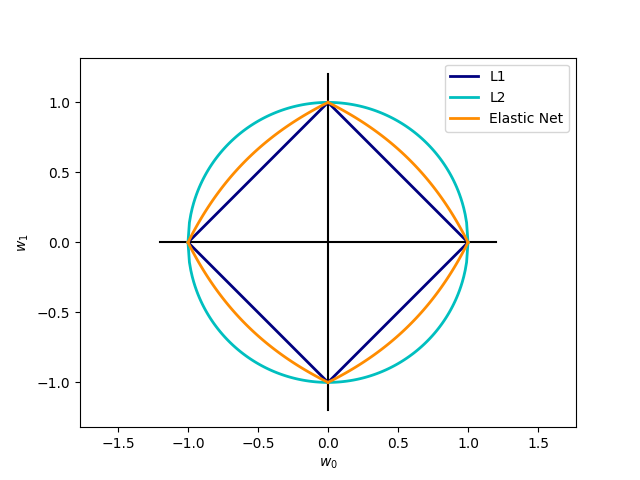

# 1.5\. 随机梯度下降

校验者:
        [@A](https://github.com/apachecn/scikit-learn-doc-zh)
翻译者:
        [@L](https://github.com/apachecn/scikit-learn-doc-zh)
校验者:
        [@HelloSilicat](https://github.com/HelloSilicat)
        [@A](https://github.com/apachecn/scikit-learn-doc-zh)
翻译者:
        [@L](https://github.com/apachecn/scikit-learn-doc-zh)

**随机梯度下降(SGD)** 是一种简单但又非常高效的方法，主要用于凸损失函数下线性分类器的判别式学习，例如(线性) [支持向量机](https://en.wikipedia.org/wiki/Support_vector_machine) 和 [Logistic 回归](https://en.wikipedia.org/wiki/Logistic_regression) 。 尽管 SGD 在机器学习社区已经存在了很长时间, 但是最近在 large-scale learning （大规模学习）方面 SGD 获得了相当大的关注。

SGD 已成功应用于在文本分类和自然语言处理中经常遇到的大规模和稀疏的机器学习问题。对于稀疏数据，本模块的分类器可以轻易的处理超过 10^5 的训练样本和超过 10^5 的特征。

Stochastic Gradient Descent （随机梯度下降法）的优势:

> *   高效。
> *   易于实现 (有大量优化代码的机会)。

Stochastic Gradient Descent （随机梯度下降法）的劣势:

> *   SGD 需要一些超参数，例如 regularization （正则化）参数和 number of iterations （迭代次数）。
> *   SGD 对 feature scaling （特征缩放）敏感。

## 1.5.1\. 分类

Warning

在拟合模型前，确保你重新排列了（打乱）)你的训练数据，或者在每次迭代后用 `shuffle=True` 来打乱。

[`SGDClassifier`](generated/sklearn.linear_model.SGDClassifier.html#sklearn.linear_model.SGDClassifier "sklearn.linear_model.SGDClassifier") 类实现了一个简单的随机梯度下降学习例程, 支持不同的 loss functions（损失函数）和 penalties for classification（分类处罚）。

[](../auto_examples/linear_model/plot_sgd_separating_hyperplane.html)

作为另一个 classifier （分类器）, 拟合 SGD 我们需要两个 array （数组）：保存训练样本的 size 为 [n_samples, n_features] 的数组 X 以及保存训练样本目标值（类标签）的 size 为 [n_samples] 的数组 Y

```py
>>> from sklearn.linear_model import SGDClassifier
>>> X = [[0., 0.], [1., 1.]]
>>> y = [0, 1]
>>> clf = SGDClassifier(loss="hinge", penalty="l2")
>>> clf.fit(X, y)
SGDClassifier(alpha=0.0001, average=False, class_weight=None, epsilon=0.1,
 eta0=0.0, fit_intercept=True, l1_ratio=0.15,
 learning_rate='optimal', loss='hinge', max_iter=5, n_iter=None,
 n_jobs=1, penalty='l2', power_t=0.5, random_state=None,
 shuffle=True, tol=None, verbose=0, warm_start=False)

```

拟合后，我们可以用该模型来预测新值:

```py
>>> clf.predict([[2., 2.]])
array([1])

```

SGD 通过训练数据来拟合一个线性模型。成员 `coef_` 保存模型参数:

```py
>>> clf.coef_                                         
array([[ 9.9...,  9.9...]])

```

成员 `intercept_` 保存 intercept（截距） （又称作 offset（偏移）或 bias（偏差））:

```py
>>> clf.intercept_                                    
array([-9.9...])

```

模型是否使用 intercept（截距）, 即 a biased hyperplane(一个偏置的超平面), 是由参数 `fit_intercept` 控制的。

使用 [`SGDClassifier.decision_function`](generated/sklearn.linear_model.SGDClassifier.html#sklearn.linear_model.SGDClassifier.decision_function "sklearn.linear_model.SGDClassifier.decision_function") 来获得到此超平面的 signed distance (符号距离)

```py
>>> clf.decision_function([[2., 2.]])                 
array([ 29.6...])

```

具体的 loss function（损失函数） 可以通过 `loss` 参数来设置。 [`SGDClassifier`](generated/sklearn.linear_model.SGDClassifier.html#sklearn.linear_model.SGDClassifier "sklearn.linear_model.SGDClassifier") 支持以下的 loss functions（损失函数）：

> *   `loss="hinge"`: (soft-margin) linear Support Vector Machine （（软-间隔）线性支持向量机），
> *   `loss="modified_huber"`: smoothed hinge loss （平滑的 hinge 损失），
> *   `loss="log"`: logistic regression （logistic 回归），
> *   and all regression losses below（以及所有的回归损失）。

前两个 loss functions（损失函数）是懒惰的，如果一个例子违反了 margin constraint（边界约束），它们仅更新模型的参数, 这使得训练非常有效率,即使使用了 L2 penalty（惩罚）我们仍然可能得到稀疏的模型结果。

使用 `loss="log"` 或者 `loss="modified_huber"` 来启用 `predict_proba` 方法, 其给出每个样本  的概率估计  的一个向量：

```py
>>> clf = SGDClassifier(loss="log").fit(X, y)
>>> clf.predict_proba([[1., 1.]])                      
array([[ 0.00...,  0.99...]])

```

具体的惩罚方法可以通过 `penalty` 参数来设定。 SGD 支持以下 penalties（惩罚）:

> *   `penalty="l2"`: L2 norm penalty on `coef_`.
> *   `penalty="l1"`: L1 norm penalty on `coef_`.
> *   `penalty="elasticnet"`: Convex combination of L2 and L1（L2 型和 L1 型的凸组合）; `(1 - l1_ratio) * L2 + l1_ratio * L1`.

默认设置为 `penalty="l2"` 。 L1 penalty （惩罚）导致稀疏解，使得大多数系数为零。 Elastic Net（弹性网）解决了在特征高相关时 L1 penalty（惩罚）的一些不足。参数 `l1_ratio` 控制了 L1 和 L2 penalty（惩罚）的 convex combination （凸组合）。

[`SGDClassifier`](generated/sklearn.linear_model.SGDClassifier.html#sklearn.linear_model.SGDClassifier "sklearn.linear_model.SGDClassifier") 通过利用 “one versus all” （OVA）方法来组合多个二分类器，从而实现多分类。对于每一个  类, 可以训练一个二分类器来区分自身和其他  个类。在测试阶段，我们计算每个分类器的 confidence score（置信度分数）（也就是与超平面的距离），并选择置信度最高的分类。下图阐释了基于 iris（鸢尾花）数据集上的 OVA 方法。虚线表示三个 OVA 分类器; 不同背景色代表由三个分类器产生的决策面。

[](../auto_examples/linear_model/plot_sgd_iris.html)

在 multi-class classification （多类分类）的情况下， `coef_` 是 `shape=[n_classes, n_features]` 的一个二维数组， `intercept_` 是 `shape=[n_classes]` 的一个一维数组。 `coef_` 的第 i 行保存了第 i 类的 OVA 分类器的权重向量；类以升序索引 （参照属性 `classes_` ）。 注意，原则上，由于它们允许创建一个概率模型，所以 `loss="log"` 和 `loss="modified_huber"` 更适合于 one-vs-all 分类。

[`SGDClassifier`](generated/sklearn.linear_model.SGDClassifier.html#sklearn.linear_model.SGDClassifier "sklearn.linear_model.SGDClassifier") 通过拟合参数 `class_weight` 和 `sample_weight` 来支持 weighted classes （加权类）和 weighted instances（加权实例）。更多信息请参照下面的示例和 [`SGDClassifier.fit`](generated/sklearn.linear_model.SGDClassifier.html#sklearn.linear_model.SGDClassifier.fit "sklearn.linear_model.SGDClassifier.fit") 的文档。

示例:

*   [SGD: Maximum margin separating hyperplane](../auto_examples/linear_model/plot_sgd_separating_hyperplane.html#sphx-glr-auto-examples-linear-model-plot-sgd-separating-hyperplane-py),
*   [Plot multi-class SGD on the iris dataset](../auto_examples/linear_model/plot_sgd_iris.html#sphx-glr-auto-examples-linear-model-plot-sgd-iris-py)
*   [SGD: Weighted samples](../auto_examples/linear_model/plot_sgd_weighted_samples.html#sphx-glr-auto-examples-linear-model-plot-sgd-weighted-samples-py)
*   [Comparing various online solvers](../auto_examples/linear_model/plot_sgd_comparison.html#sphx-glr-auto-examples-linear-model-plot-sgd-comparison-py)
*   [SVM: Separating hyperplane for unbalanced classes](../auto_examples/svm/plot_separating_hyperplane_unbalanced.html#sphx-glr-auto-examples-svm-plot-separating-hyperplane-unbalanced-py) (参见 &lt;cite&gt;Note&lt;/cite&gt;)

[`SGDClassifier`](generated/sklearn.linear_model.SGDClassifier.html#sklearn.linear_model.SGDClassifier "sklearn.linear_model.SGDClassifier") 支持 averaged SGD (ASGD)。Averaging（均值化）可以通过设置 ``average=True`` 来启用。AGSD 工作原理是在普通 SGD 的基础上，对每个样本的每次迭代后的系数取均值。当使用 ASGD 时，学习速率可以更大甚至是恒定，在一些数据集上能够加速训练过程。

对于带 logistic loss（logistic 损失）的分类，在 [`LogisticRegression`](generated/sklearn.linear_model.LogisticRegression.html#sklearn.linear_model.LogisticRegression "sklearn.linear_model.LogisticRegression") 中提供了另一个采取 averaging strategy（平均策略）的 SGD 变体，其使用了随机平均梯度 (SAG) 算法。

## 1.5.2\. 回归

[`SGDRegressor`](generated/sklearn.linear_model.SGDRegressor.html#sklearn.linear_model.SGDRegressor "sklearn.linear_model.SGDRegressor") 类实现了一个简单的随机梯度下降学习例程，它支持用不同的损失函数和惩罚来拟合线性回归模型。 [`SGDRegressor`](generated/sklearn.linear_model.SGDRegressor.html#sklearn.linear_model.SGDRegressor "sklearn.linear_model.SGDRegressor") 非常适用于有大量训练样本（&gt;10.000)的回归问题，对于其他问题，我们推荐使用 [`Ridge`](generated/sklearn.linear_model.Ridge.html#sklearn.linear_model.Ridge "sklearn.linear_model.Ridge") ，[`Lasso`](generated/sklearn.linear_model.Lasso.html#sklearn.linear_model.Lasso "sklearn.linear_model.Lasso") ，或 [`ElasticNet`](generated/sklearn.linear_model.ElasticNet.html#sklearn.linear_model.ElasticNet "sklearn.linear_model.ElasticNet") 。

具体的损失函数可以通过 `loss` 参数设置。 [`SGDRegressor`](generated/sklearn.linear_model.SGDRegressor.html#sklearn.linear_model.SGDRegressor "sklearn.linear_model.SGDRegressor") 支持以下的损失函数:

> *   `loss="squared_loss"`: Ordinary least squares（普通最小二乘法）,
> *   `loss="huber"`: Huber loss for robust regression（Huber回归）,
> *   `loss="epsilon_insensitive"`: linear Support Vector Regression（线性支持向量回归）.

Huber 和 epsilon-insensitive 损失函数可用于 robust regression（鲁棒回归）。不敏感区域的宽度必须通过参数 `epsilon` 来设定。这个参数取决于目标变量的规模。

[`SGDRegressor`](generated/sklearn.linear_model.SGDRegressor.html#sklearn.linear_model.SGDRegressor "sklearn.linear_model.SGDRegressor") 支持 ASGD（平均随机梯度下降） 作为 [`SGDClassifier`](generated/sklearn.linear_model.SGDClassifier.html#sklearn.linear_model.SGDClassifier "sklearn.linear_model.SGDClassifier")。 均值化可以通过设置 ``average=True`` 来启用。

对于利用了 squared loss（平方损失）和 l2 penalty（l2惩罚）的回归，在 [`Ridge`](generated/sklearn.linear_model.Ridge.html#sklearn.linear_model.Ridge "sklearn.linear_model.Ridge") 中提供了另一个采取 averaging strategy（平均策略）的 SGD 变体，其使用了随机平均梯度 (SAG) 算法。

## 1.5.3\. 稀疏数据的随机梯度下降

Note

由于在截距部分收敛学习速率的差异，稀疏实现与密集实现相比产生的结果略有不同。

在 [scipy.sparse](https://docs.scipy.org/doc/scipy/reference/sparse.html) 支持的格式中，任意矩阵都有对稀疏数据的内置支持方法。但是，为了获得最高的效率，请使用 [scipy.sparse.csr_matrix](http://docs.scipy.org/doc/scipy/reference/generated/scipy.sparse.csr_matrix.html) 中定义的 CSR 矩阵格式.

示例:

*   [Classification of text documents using sparse features](../auto_examples/text/document_classification_20newsgroups.html#sphx-glr-auto-examples-text-document-classification-20newsgroups-py)

## 1.5.4\. 复杂度

SGD 主要的优势在于它的高效性，对于不同规模的训练样本，处理复杂度基本上是线性的。假如 X 是 size 为 (n, p) 的矩阵，训练成本为 ，其中 k 是迭代次数，  是每个样本非零特征的平均数。

但是，最近的理论结果表明，得到期望优化精度的运行时间并不会随着训练集规模扩大而增加。

## 1.5.5\. 实用小贴士

> *   随机梯度下降法对 feature scaling （特征缩放）很敏感，因此强烈建议您缩放您的数据。例如，将输入向量 X 上的每个特征缩放到 [0,1] 或 [- 1，+1]， 或将其标准化，使其均值为 0，方差为 1。请注意，必须将 _相同_ 的缩放应用于对应的测试向量中，以获得有意义的结果。使用 `StandardScaler`: 很容易做到这一点：
>     
>     
>     
>     &gt; from sklearn.preprocessing import StandardScaler scaler = StandardScaler() scaler.fit(X_train) # Don’t cheat - fit only on training data X_train = scaler.transform(X_train) X_test = scaler.transform(X_test) # apply same transformation to test data
>     
>     
>     
>     假如你的 attributes （属性）有一个固有尺度（例如 word frequencies （词频）或 indicator features（指标特征））就不需要缩放。
>     
>     
> *   最好使用 `GridSearchCV` 找到一个合理的 regularization term （正则化项）  ， 它的范围通常在 `10.0**-np.arange(1,7)` 。
>     
>     
> *   经验表明，SGD 在处理约 10^6 训练样本后基本收敛。因此，对于迭代次数第一个合理的猜想是 `n_iter = np.ceil(10**6 / n)`，其中 `n` 是训练集的大小。
>     
>     
> *   假如将 SGD 应用于使用 PCA 做特征提取，我们发现通过某个常数 &lt;cite&gt;c&lt;/cite&gt; 来缩放特征值是明智的，比如使训练数据的 L2 norm 平均值为 1。
>     
>     
> *   我们发现，当特征很多或 eta0 很大时， ASGD（平均随机梯度下降） 效果更好。

参考文献:

*   [“Efficient BackProp”](http://yann.lecun.com/exdb/publis/pdf/lecun-98b.pdf) Y. LeCun, L. Bottou, G. Orr, K. Müller - In Neural Networks: Tricks of the Trade 1998.

## 1.5.6\. 数学描述

给定一组训练样本  ，其中  ， ， 我们的目标是一个线性 scoring function（评价函数）  ，其中模型参数  ，截距 。为了做预测， 我们只需要看  的符号。找到模型参数的一般选择是通过最小化由以下式子给出的正则化训练误差


其中  衡量模型(mis)拟合程度的损失函数， 是惩罚模型复杂度的正则化项（也叫作惩罚）;  是一个非负超平面。

 的不同选择产生不同的分类器，例如

> *   Hinge: (soft-margin) Support Vector Machines.
> *   Hinge: (软-间隔) 支持向量机。
> *   Log: Logistic Regression.
> *   Log: Logistic 回归。
> *   Least-Squares: Ridge Regression.
> *   Least-Squares: 岭回归。
> *   Epsilon-Insensitive: (soft-margin) Support Vector Regression.
> *   Epsilon-Insensitive: (软-间隔) 支持向量回归。

所有上述损失函数可以看作是错误分类误差的上限（0 - 1损失），如下图所示。

[](../auto_examples/linear_model/plot_sgd_loss_functions.html)

比较流行的正则化项  包括：

> *   L2 norm: ,
> *   L1 norm: , which leads to sparse solutions（）.
> *   Elastic Net: , a convex combination of L2 and L1, where  is given by `1 - l1_ratio`.

下图显示当  时参数空间中不同正则项的轮廓。

[](../auto_examples/linear_model/plot_sgd_penalties.html)

### 1.5.6.1\. SGD

随机梯度下降法是一种无约束优化问题的优化方法。与（批量）梯度下降法相反，SGD 通过一次只考虑单个训练样本来近似  真实的梯度。

[`SGDClassifier`](generated/sklearn.linear_model.SGDClassifier.html#sklearn.linear_model.SGDClassifier "sklearn.linear_model.SGDClassifier") 类实现了一个 first-order SGD learning routine （一阶 SGD 学习程序）。 算法在训练样本上遍历，并且对每个样本根据由以下式子给出的更新规则来更新模型参数。

```py


```

其中  是在参数空间中控制步长的 learning rate （学习速率）。 intercept（截距）  的更新类似但不需要正则化。

学习率  可以恒定或者逐渐减小。对于分类来说， 默认的学习率设定方案 （`learning_rate='optimal'`）由下式给出。


其中  是时间步长（总共有 &lt;cite&gt;n_samples * n_iter&lt;/cite&gt; 时间步长），  是由 Léon Bottou 提出的启发式算法决定的，比如预期的初始更新可以设定为权重的期望大小（假设训练样本的范数近似1）。在 `BaseSGD` 中的 `_init_t` 中可以找到确切的定义。

对于回归来说，默认的学习率是反向缩放 (`learning_rate='invscaling'`)，由下式给出


其中  和  是用户通过 `eta0` 和 `power_t` 分别选择的超参数。

使用固定的学习速率则设置 `learning_rate='constant'` ，或者设置 `eta0` 来指定学习速率。

模型参数可以通过成员 `coef_` 和 `intercept_` 来获得：

> *   成员 `coef_` holds the weights（控制权重） 
> *   成员 `intercept_` holds 

参考文献：

*   [“Solving large scale linear prediction problems using stochastic gradient descent algorithms”](http://citeseerx.ist.psu.edu/viewdoc/summary?doi=10.1.1.58.7377) T. Zhang - In Proceedings of ICML ‘04.
*   [“Regularization and variable selection via the elastic net”](http://citeseerx.ist.psu.edu/viewdoc/summary?doi=10.1.1.124.4696) H. Zou, T. Hastie - Journal of the Royal Statistical Society Series B, 67 (2), 301-320.
*   [“Towards Optimal One Pass Large Scale Learning with Averaged Stochastic Gradient Descent”](http://arxiv.org/pdf/1107.2490v2.pdf) Xu, Wei

## 1.5.7\. 实现细节

SGD 的实现受到了 Léon Bottou [Stochastic Gradient SVM](http://leon.bottou.org/projects/sgd) 的影响。类似于 SvmSGD，权重向量表达为一个标量和一个向量的内积，这样保证在使用L2正则项时可以高效更新权重。 在 sparse feature vectors （稀疏特征向量）的情况下， intercept （截距）是以更小的学习率（乘以 0.01）更新的，这导致了它的更新更加频繁。训练样本按顺序选取并且每处理一个样本就要降低学习速率。我们采用了 Shalev-Shwartz 等人2007年提出的的学习速率设定方案。 对于多类分类，我们使用了 “one versus all” 方法。 我们在 L1 正则化（和 Elastic Net ）中使用 Tsuruoka 等人2009年提出的 truncated gradient algorithm （截断梯度算法）。代码是用 Cython 编写的。

参考文献:

*   [“Stochastic Gradient Descent”](http://leon.bottou.org/projects/sgd) L. Bottou - Website, 2010.
*   [“The Tradeoffs of Large Scale Machine Learning”](http://leon.bottou.org/slides/largescale/lstut.pdf) L. Bottou - Website, 2011.
*   [“Pegasos: Primal estimated sub-gradient solver for svm”](http://citeseerx.ist.psu.edu/viewdoc/summary?doi=10.1.1.74.8513) S. Shalev-Shwartz, Y. Singer, N. Srebro - In Proceedings of ICML ‘07.
*   [“Stochastic gradient descent training for l1-regularized log-linear models with cumulative penalty”](http://www.aclweb.org/anthology/P/P09/P09-1054.pdf) Y. Tsuruoka, J. Tsujii, S. Ananiadou - In Proceedings of the AFNLP/ACL ‘09.