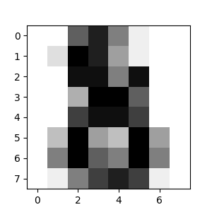

# 使用 scikit-learn 介绍机器学习

校验者:
        [@小瑶](https://github.com/apachecn/scikit-learn-doc-zh)
翻译者:
        [@李昊伟](https://github.com/apachecn/scikit-learn-doc-zh)
校验者:
        [@hlxstc](https://github.com/hlxstc)
        [@BWM-蜜蜂](https://github.com/apachecn/scikit-learn-doc-zh)
        [@小瑶](https://github.com/apachecn/scikit-learn-doc-zh)
翻译者:
        [@...](https://github.com/apachecn/scikit-learn-doc-zh)

内容提要

在本节中，我们介绍一些在使用 scikit-learn 过程中用到的 [机器学习](https://en.wikipedia.org/wiki/Machine_learning) 词汇，并且给出一些例子阐释它们。

## 机器学习：问题设置

一般来说，一个学习问题通常会考虑一系列 n 个 [样本](https://en.wikipedia.org/wiki/Sample_(statistics)) 数据，然后尝试预测未知数据的属性。 如果每个样本是 [多个属性的数据](https://en.wikipedia.org/wiki/Multivariate_random_variable) （比如说是一个多维记录），就说它有许多“属性”，或称 **features(特征)** 。

我们可以将学习问题分为几大类:

> *   [监督学习](https://en.wikipedia.org/wiki/Supervised_learning) , 其中数据带有一个附加属性，即我们想要预测的结果值（ [点击此处](../../supervised_learning.html#supervised-learning) 转到 scikit-learn 监督学习页面）。这个问题可以是:
>     
>     
>     
>     &gt; *   [分类](https://en.wikipedia.org/wiki/Classification_in_machine_learning) : 样本属于两个或更多个类，我们想从已经标记的数据中学习如何预测未标记数据的类别。 分类问题的一个例子是手写数字识别，其目的是将每个输入向量分配给有限数目的离散类别之一。 我们通常把分类视作监督学习的一个离散形式（区别于连续形式），从有限的类别中，给每个样本贴上正确的标签。
>     &gt; *   [回归](https://en.wikipedia.org/wiki/Regression_analysis) : 如果期望的输出由一个或多个连续变量组成，则该任务称为 _回归_ 。 回归问题的一个例子是预测鲑鱼的长度是其年龄和体重的函数。
>     
>     
> *   [无监督学习](https://en.wikipedia.org/wiki/Unsupervised_learning), 其中训练数据由没有任何相应目标值的一组输入向量x组成。这种问题的目标可能是在数据中发现彼此类似的示例所聚成的组，这种问题称为 [聚类](https://en.wikipedia.org/wiki/Cluster_analysis) , 或者，确定输入空间内的数据分布，称为 [密度估计](https://en.wikipedia.org/wiki/Density_estimation) ，又或从高维数据投影数据空间缩小到二维或三维以进行 _可视化_ （[点击此处](../../unsupervised_learning.html#unsupervised-learning) 转到 scikit-learn 无监督学习页面）。

训练集和测试集

机器学习是从数据的属性中学习，并将它们应用到新数据的过程。 这就是为什么机器学习中评估算法的普遍实践是把数据分割成 **训练集** （我们从中学习数据的属性）和 **测试集** （我们测试这些性质）。

## 加载示例数据集

*scikit-learn* 提供了一些标准数据集，例如 用于分类的 [iris](https://en.wikipedia.org/wiki/Iris_flower_data_set) 和 [digits](http://archive.ics.uci.edu/ml/datasets/Pen-Based+Recognition+of+Handwritten+Digits) 数据集 和 [波士顿房价回归数据集](http://archive.ics.uci.edu/ml/datasets/Housing) .

在下文中，我们从我们的 shell 启动一个 Python 解释器，然后加载 `iris` 和 `digits` 数据集。我们的符号约定是 `$` 表示 shell 提示符，而 `&gt;&gt;&gt;` 表示 Python 解释器提示符:

```py
$ python
>>> from sklearn import datasets
>>> iris = datasets.load_iris()
>>> digits = datasets.load_digits()

```

数据集是一个类似字典的对象，它保存有关数据的所有数据和一些元数据。 该数据存储在 `.data` 成员中，它是 `n_samples, n_features` 数组。 在监督问题的情况下，一个或多个响应变量存储在 `.target` 成员中。 有关不同数据集的更多详细信息，请参见 [专用数据集部分](../../datasets/index.html#datasets) 。

例如，在数字数据集的情况下，`digits.data` 使我们能够得到一些用于分类的样本特征:

```py
>>> print(digits.data)  
[[  0\.   0\.   5\. ...,   0\.   0\.   0.]
 [  0\.   0\.   0\. ...,  10\.   0\.   0.]
 [  0\.   0\.   0\. ...,  16\.   9\.   0.]
 ...,
 [  0\.   0\.   1\. ...,   6\.   0\.   0.]
 [  0\.   0\.   2\. ...,  12\.   0\.   0.]
 [  0\.   0\.  10\. ...,  12\.   1\.   0.]]

```

并且 `digits.target` 表示了数据集内每个数字的真实类别，也就是我们期望从每个手写数字图像中学得的相应的数字标记:

```py
>>> digits.target
array([0, 1, 2, ..., 8, 9, 8])

```

数据数组的形状

数据总是二维数组，形状 `(n_samples, n_features)` ，尽管原始数据可能具有不同的形状。 在数字的情况下，每个原始样本是形状 `(8, 8)` 的图像，可以使用以下方式访问:

```py
>>> digits.images[0]
array([[  0.,   0.,   5.,  13.,   9.,   1.,   0.,   0.],
 [  0.,   0.,  13.,  15.,  10.,  15.,   5.,   0.],
 [  0.,   3.,  15.,   2.,   0.,  11.,   8.,   0.],
 [  0.,   4.,  12.,   0.,   0.,   8.,   8.,   0.],
 [  0.,   5.,   8.,   0.,   0.,   9.,   8.,   0.],
 [  0.,   4.,  11.,   0.,   1.,  12.,   7.,   0.],
 [  0.,   2.,  14.,   5.,  10.,  12.,   0.,   0.],
 [  0.,   0.,   6.,  13.,  10.,   0.,   0.,   0.]])

```

该 [数据集上的简单示例](../../auto_examples/classification/plot_digits_classification.html#sphx-glr-auto-examples-classification-plot-digits-classification-py) 说明了如何从原始数据开始调整，形成可以在 scikit-learn 中使用的数据。

从外部数据集加载

要从外部数据集加载，请参阅 [加载外部数据集](../../datasets/index.html#external-datasets) 。

## 学习和预测

在数字数据集的情况下，任务是给出图像来预测其表示的数字。 我们给出了 10 个可能类（数字 0 到 9）中的每一个的样本，我们在这些类上 _拟合_ 一个 [估计器](https://en.wikipedia.org/wiki/Estimator) ，以便能够 _预测_ 未知的样本所属的类。

在 scikit-learn 中，分类的估计器是一个 Python 对象，它实现了 `fit(X, y)` 和 `predict(T)` 等方法。

估计器的一个例子类 `sklearn.svm.SVC` ，实现了 [支持向量分类](https://en.wikipedia.org/wiki/Support_vector_machine) 。 估计器的构造函数以相应模型的参数为参数，但目前我们将把估计器视为黑箱即可:

```py
>>> from sklearn import svm
>>> clf = svm.SVC(gamma=0.001, C=100.)

```

选择模型的参数

在这个例子中，我们手动设置 `gamma` 值。不过，通过使用 [网格搜索](../../modules/grid_search.html#grid-search) 及 [交叉验证](../../modules/cross_validation.html#cross-validation) 等工具，可以自动找到参数的良好值。

我们把我们的估计器实例命名为 `clf` ，因为它是一个分类器（classifier）。它现在必须拟合模型，也就是说，它必须从模型中 _learn（学习）_ 。 这是通过将我们的训练集传递给 `fit` 方法来完成的。作为一个训练集，让我们使用数据集中除最后一张以外的所有图像。 我们用 `[:-1]` Python 语法选择这个训练集，它产生一个包含 `digits.data` 中除最后一个条目（entry）之外的所有条目的新数组

```py
>>> clf.fit(digits.data[:-1], digits.target[:-1])  
SVC(C=100.0, cache_size=200, class_weight=None, coef0=0.0,
 decision_function_shape='ovr', degree=3, gamma=0.001, kernel='rbf',
 max_iter=-1, probability=False, random_state=None, shrinking=True,
 tol=0.001, verbose=False)

```

现在你可以预测新的值，特别是我们可以向分类器询问 `digits` 数据集中最后一个图像（没有用来训练的一条实例）的数字是什么:

```py
>>> clf.predict(digits.data[-1:])
array([8])

```

相应的图像如下:

[](../../auto_examples/datasets/plot_digits_last_image.html)

正如你所看到的，这是一项具有挑战性的任务：图像分辨率差。你是否认同这个分类？

这个分类问题的一个完整例子可以作为一个例子来运行和学习： 识别手写数字。 [Recognizing hand-written digits](../../auto_examples/classification/plot_digits_classification.html#sphx-glr-auto-examples-classification-plot-digits-classification-py).

## 模型持久化

可以通过使用 Python 的内置持久化模块（即 [pickle](https://docs.python.org/2/library/pickle.html) ）将模型保存:

```py
>>> from sklearn import svm
>>> from sklearn import datasets
>>> clf = svm.SVC()
>>> iris = datasets.load_iris()
>>> X, y = iris.data, iris.target
>>> clf.fit(X, y)  
SVC(C=1.0, cache_size=200, class_weight=None, coef0=0.0,
 decision_function_shape='ovr', degree=3, gamma='auto', kernel='rbf',
 max_iter=-1, probability=False, random_state=None, shrinking=True,
 tol=0.001, verbose=False)

>>> import pickle
>>> s = pickle.dumps(clf)
>>> clf2 = pickle.loads(s)
>>> clf2.predict(X[0:1])
array([0])
>>> y[0]
0

```

在scikit的具体情况下，使用 joblib 替换 pickle（ `joblib.dump` & `joblib.load` ）可能会更有趣，这对大数据更有效，但只能序列化 (pickle) 到磁盘而不是字符串变量:

```py
>>> from sklearn.externals import joblib
>>> joblib.dump(clf, 'filename.pkl') 

```

之后，您可以加载已保存的模型（可能在另一个 Python 进程中）:

```py
>>> clf = joblib.load('filename.pkl') 

```

Warning

`joblib.dump` 以及 `joblib.load` 函数也接受 file-like（类文件） 对象而不是文件名。有关 Joblib 的数据持久化的更多信息，请 [点击此处](https://pythonhosted.org/joblib/persistence.html) 。

请注意，pickle 有一些安全性和维护性问题。有关使用 scikit-learn 的模型持久化的更多详细信息，请参阅 [模型持久化](../../modules/model_persistence.html#model-persistence) 部分。

## 规定

scikit-learn 估计器遵循某些规则，使其行为更可预测。

### 类型转换

除非特别指定，输入将被转换为 `float64`

```py
>>> import numpy as np
>>> from sklearn import random_projection

>>> rng = np.random.RandomState(0)
>>> X = rng.rand(10, 2000)
>>> X = np.array(X, dtype='float32')
>>> X.dtype
dtype('float32')

>>> transformer = random_projection.GaussianRandomProjection()
>>> X_new = transformer.fit_transform(X)
>>> X_new.dtype
dtype('float64')

```

在这个例子中，`X` 原本是 `float32` ，被 `fit_transform(X)` 转换成 `float64` 。

回归目标被转换为 `float64` ，但分类目标维持不变:

```py
>>> from sklearn import datasets
>>> from sklearn.svm import SVC
>>> iris = datasets.load_iris()
>>> clf = SVC()
>>> clf.fit(iris.data, iris.target)  
SVC(C=1.0, cache_size=200, class_weight=None, coef0=0.0,
 decision_function_shape='ovr', degree=3, gamma='auto', kernel='rbf',
 max_iter=-1, probability=False, random_state=None, shrinking=True,
 tol=0.001, verbose=False)

>>> list(clf.predict(iris.data[:3]))
[0, 0, 0]

>>> clf.fit(iris.data, iris.target_names[iris.target])  
SVC(C=1.0, cache_size=200, class_weight=None, coef0=0.0,
 decision_function_shape='ovr', degree=3, gamma='auto', kernel='rbf',
 max_iter=-1, probability=False, random_state=None, shrinking=True,
 tol=0.001, verbose=False)

>>> list(clf.predict(iris.data[:3]))  
['setosa', 'setosa', 'setosa']

```

这里，第一个 `predict()` 返回一个整数数组，因为在 `fit` 中使用了 `iris.target` （一个整数数组）。 第二个 `predict()` 返回一个字符串数组，因为 `iris.target_names` 是一个字符串数组。

### 再次训练和更新参数

估计器的超参数可以通过 [`sklearn.pipeline.Pipeline.set_params`](../../modules/generated/sklearn.pipeline.Pipeline.html#sklearn.pipeline.Pipeline.set_params "sklearn.pipeline.Pipeline.set_params") 方法在实例化之后进行更新。 调用 `fit()` 多次将覆盖以前的 `fit()` 所学到的参数:

```py
>>> import numpy as np
>>> from sklearn.svm import SVC

>>> rng = np.random.RandomState(0)
>>> X = rng.rand(100, 10)
>>> y = rng.binomial(1, 0.5, 100)
>>> X_test = rng.rand(5, 10)

>>> clf = SVC()
>>> clf.set_params(kernel='linear').fit(X, y)  
SVC(C=1.0, cache_size=200, class_weight=None, coef0=0.0,
 decision_function_shape='ovr', degree=3, gamma='auto', kernel='linear',
 max_iter=-1, probability=False, random_state=None, shrinking=True,
 tol=0.001, verbose=False)
>>> clf.predict(X_test)
array([1, 0, 1, 1, 0])

>>> clf.set_params(kernel='rbf').fit(X, y)  
SVC(C=1.0, cache_size=200, class_weight=None, coef0=0.0,
 decision_function_shape='ovr', degree=3, gamma='auto', kernel='rbf',
 max_iter=-1, probability=False, random_state=None, shrinking=True,
 tol=0.001, verbose=False)
>>> clf.predict(X_test)
array([0, 0, 0, 1, 0])

```

在这里，估计器被 `SVC()` 构造之后，默认内核 `rbf` 首先被改变到 `linear` ，然后改回到 `rbf` 重新训练估计器并进行第二次预测。

### 多分类与多标签拟合

当使用 [`多类分类器`](../../modules/classes.html#module-sklearn.multiclass "sklearn.multiclass") 时，执行的学习和预测任务取决于参与训练的目标数据的格式:

```py
>>> from sklearn.svm import SVC
>>> from sklearn.multiclass import OneVsRestClassifier
>>> from sklearn.preprocessing import LabelBinarizer

>>> X = [[1, 2], [2, 4], [4, 5], [3, 2], [3, 1]]
>>> y = [0, 0, 1, 1, 2]

>>> classif = OneVsRestClassifier(estimator=SVC(random_state=0))
>>> classif.fit(X, y).predict(X)
array([0, 0, 1, 1, 2])

```

在上述情况下，分类器使用含有多个标签的一维数组训练模型，因此 `predict()` 方法可提供相应的多标签预测。分类器也可以通过标签二值化后的二维数组来训练:

```py
>>> y = LabelBinarizer().fit_transform(y)
>>> classif.fit(X, y).predict(X)
array([[1, 0, 0],
 [1, 0, 0],
 [0, 1, 0],
 [0, 0, 0],
 [0, 0, 0]])

```

这里，使用 [`LabelBinarizer`](../../modules/generated/sklearn.preprocessing.LabelBinarizer.html#sklearn.preprocessing.LabelBinarizer "sklearn.preprocessing.LabelBinarizer") 将目标向量 y 转化成二值化后的二维数组。在这种情况下， `predict()` 返回一个多标签预测相应的 二维 数组。

请注意，第四个和第五个实例返回全零向量，表明它们不能匹配用来训练中的目标标签中的任意一个。使用多标签输出，类似地可以为一个实例分配多个标签:

```py
>> from sklearn.preprocessing import MultiLabelBinarizer
>> y = [[0, 1], [0, 2], [1, 3], [0, 2, 3], [2, 4]]
>> y = MultiLabelBinarizer().fit_transform(y)
>> classif.fit(X, y).predict(X)
array([[1, 1, 0, 0, 0],
       [1, 0, 1, 0, 0],
       [0, 1, 0, 1, 0],
       [1, 0, 1, 1, 0],
       [0, 0, 1, 0, 1]])

```

在这种情况下，用来训练分类器的多个向量被赋予多个标记， [`MultiLabelBinarizer`](../../modules/generated/sklearn.preprocessing.MultiLabelBinarizer.html#sklearn.preprocessing.MultiLabelBinarizer "sklearn.preprocessing.MultiLabelBinarizer") 用来二值化多个标签产生二维数组并用来训练。 `predict()` 函数返回带有多个标签的二维数组作为每个实例的结果。