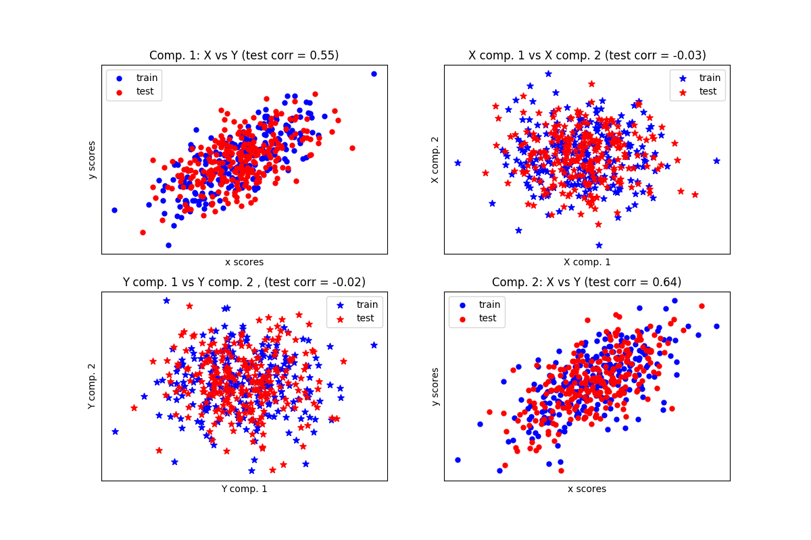

# 1.8. 交叉分解

校验者:
        [@peels](https://github.com/apachecn/scikit-learn-doc-zh)
翻译者:
        [@Counting stars](https://github.com/apachecn/scikit-learn-doc-zh)

交叉分解模块主要包含两个算法族: 偏最小二乘法（PLS）和典型相关分析（CCA）。

这些算法族具有发现两个多元数据集之间的线性关系的用途： `fit` method （拟合方法）的参数 `X` 和 `Y` 都是 2 维数组。

交叉分解算法能够找到两个矩阵 (X 和 Y) 的基础关系。它们是对在两个空间的 协方差结构进行建模的隐变量方法。它们将尝试在X空间中找到多维方向，该方向能 够解释Y空间中最大多维方差方向。PLS回归特别适用于当预测变量矩阵具有比观测值 更多的变量以及当X值存在多重共线性时。相比之下，在这些情况下，标准回归将失败。

包含在此模块中的类有：[`PLSRegression`](https://scikit-learn.org/stable/modules/generated/sklearn.cross_decomposition.PLSRegression.html#sklearn.cross_decomposition.PLSRegression "sklearn.cross_decomposition.PLSRegression"), [`PLSCanonical`](https://scikit-learn.org/stable/modules/generated/sklearn.cross_decomposition.PLSCanonical.html#sklearn.cross_decomposition.PLSCanonical "sklearn.cross_decomposition.PLSCanonical"), [`CCA`](https://scikit-learn.org/stable/modules/generated/sklearn.cross_decomposition.CCA.html#sklearn.cross_decomposition.CCA "sklearn.cross_decomposition.CCA"), [`PLSSVD`](https://scikit-learn.org/stable/modules/generated/sklearn.cross_decomposition.PLSSVD.html#sklearn.cross_decomposition.PLSSVD "sklearn.cross_decomposition.PLSSVD")
> **参考资料**：
>* JA Wegelin [A survey of Partial Least Squares (PLS) methods, with emphasis on the two-block case](https://www.stat.washington.edu/research/reports/2000/tr371.pdf)

> **示例**:
>*   [Compare cross decomposition methods](https://scikit-learn.org/stable/auto_examples/cross_decomposition/plot_compare_cross_decomposition.html#sphx-glr-auto-examples-cross-decomposition-plot-compare-cross-decomposition-py)
