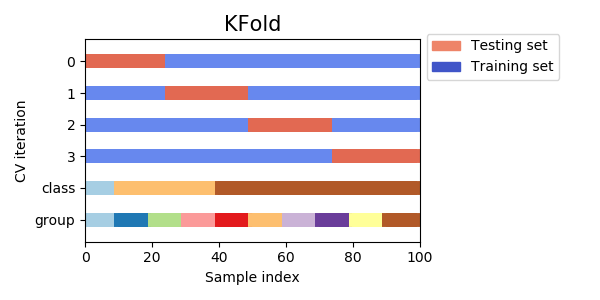
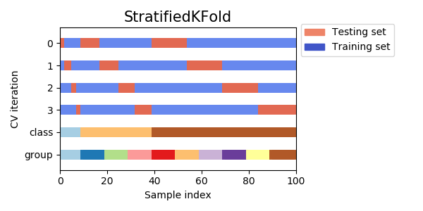
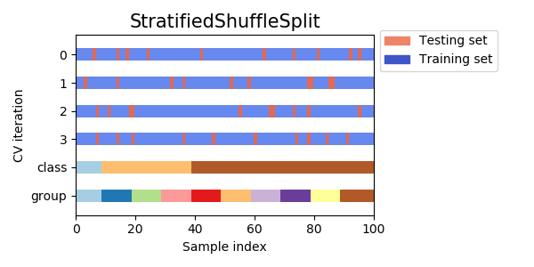
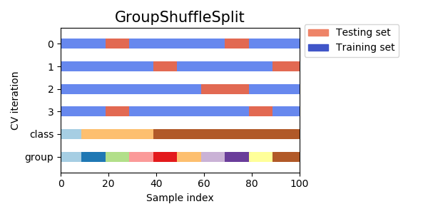

# 3.1. 交叉验证：评估估算器的表现

校验者:
        [@想和太阳肩并肩](https://github.com/apachecn/scikit-learn-doc-zh)
        [@樊雯](https://github.com/apachecn/scikit-learn-doc-zh)
        [@Loopy](https://github.com/loopyme)
翻译者:
        [@\S^R^Y/](https://github.com/apachecn/scikit-learn-doc-zh)

学习预测函数的参数，并在相同数据集上进行测试是一种错误的做法: 一个仅给出测试用例标签的模型将会获得极高的分数，但对于尚未出现过的数据它则无法预测出任何有用的信息。 这种情况称为 **overfitting（过拟合）**. 为了避免这种情况，在进行（监督）机器学习实验时，通常取出部分可利用数据作为 **test set（测试数据集）** `X_test, y_test`。需要强调的是这里说的 “experiment(实验)” 并不仅限于学术（academic），因为即使是在商业场景下机器学习也往往是从实验开始的。下面是模型训练中典型的交叉验证工作流流程图。通过[网格搜索](31)可以确定最佳参数。


利用 scikit-learn 包中的 [`train_test_split`](https://scikit-learn.org/stable/modules/generated/sklearn.model_selection.train_test_split.html#sklearn.model_selection.train_test_split "sklearn.model_selection.train_test_split") 辅助函数可以很快地将实验数据集划分为任何训练集（training sets）和测试集（test sets）。 下面让我们载入 iris 数据集，并在此数据集上训练出线性支持向量机:

```py
>>> import numpy as np
>>> from sklearn.model_selection import train_test_split
>>> from sklearn import datasets
>>> from sklearn import svm

>>> iris = datasets.load_iris()
>>> iris.data.shape, iris.target.shape
((150, 4), (150,))

```

我们能快速采样到原数据集的 40% 作为测试集，从而测试（评估）我们的分类器:

```py
>>> X_train, X_test, y_train, y_test = train_test_split(
...     iris.data, iris.target, test_size=0.4, random_state=0)

>>> X_train.shape, y_train.shape
((90, 4), (90,))
>>> X_test.shape, y_test.shape
((60, 4), (60,))

>>> clf = svm.SVC(kernel='linear', C=1).fit(X_train, y_train)
>>> clf.score(X_test, y_test)                           
0.96...

```

当评价估计器的不同设置（”hyperparameters(超参数)”）时，例如手动为 SVM 设置的 `C` 参数， 由于在训练集上，通过调整参数设置使估计器的性能达到了最佳状态；但 _在测试集上_ 可能会出现过拟合的情况。 此时，测试集上的信息反馈足以颠覆训练好的模型，评估的指标不再有效反映出模型的泛化性能。 为了解决此类问题，还应该准备另一部分被称为 “validation set(验证集)” 的数据集，模型训练完成以后在验证集上对模型进行评估。 当验证集上的评估实验比较成功时，在测试集上进行最后的评估。

然而，通过将原始数据分为3个数据集合，我们就大大减少了可用于模型学习的样本数量， 并且得到的结果依赖于集合对（训练，验证）的随机选择。

这个问题可以通过 [交叉验证（CV ）](https://en.wikipedia.org/wiki/Cross-validation_(statistics) 来解决。 交叉验证仍需要测试集做最后的模型评估，但不再需要验证集。

最基本的方法被称之为，_k-折交叉验证_ 。 k-折交叉验证将训练集划分为 k 个较小的集合（其他方法会在下面描述，主要原则基本相同）。 每一个 _k_ 折都会遵循下面的过程：

*   将  份训练集子集作为 training data （训练集）训练模型，
*   将剩余的 1 份训练集子集用于模型验证（也就是把它当做一个测试集来计算模型的性能指标，例如准确率）。

_k_-折交叉验证得出的性能指标是循环计算中每个值的平均值。 该方法虽然计算代价很高，但是它不会浪费太多的数据（如固定任意测试集的情况一样）， 在处理样本数据集较少的问题（例如，逆向推理）时比较有优势。


## 3.1.1. 计算交叉验证的指标

使用交叉验证最简单的方法是在估计器和数据集上调用 [`cross_val_score`](https://scikit-learn.org/stable/modules/generated/sklearn.model_selection.cross_val_score.html#sklearn.model_selection.cross_val_score "sklearn.model_selection.cross_val_score") 辅助函数。

下面的案例展示了如何通过分割数据，拟合模型和计算连续 5 次的分数（每次不同分割）来估计 linear kernel 支持向量机在 iris 数据集上的精度:

```py
>>> from sklearn.model_selection import cross_val_score
>>> clf = svm.SVC(kernel='linear', C=1)
>>> scores = cross_val_score(clf, iris.data, iris.target, cv=5)
>>> scores                                              
array([0.96..., 1.  ..., 0.96..., 0.96..., 1.        ])
```

评分估计的平均得分和 95% 置信区间由此给出:

```py
>>> print("Accuracy: %0.2f (+/- %0.2f)" % (scores.mean(), scores.std() * 2))
Accuracy: 0.98 (+/- 0.03)

```

默认情况下，每个 CV 迭代计算的分数是估计器的 `score` 方法。可以通过使用 scoring 参数来改变计算方式如下:

```py
>>> from sklearn import metrics
>>> scores = cross_val_score(
...     clf, iris.data, iris.target, cv=5, scoring='f1_macro')
>>> scores                                              
array([0.96..., 1.  ..., 0.96..., 0.96..., 1.        ])

```

详情请参阅 [scoring 参数: 定义模型评估规则](33) 。 在 Iris 数据集的情形下，样本在各个目标类别之间是平衡的，因此准确度和 F1-score 几乎相等。

当 `cv` 参数是一个整数时， [`cross_val_score`](https://scikit-learn.org/stable/modules/generated/sklearn.model_selection.cross_val_score.html#sklearn.model_selection.cross_val_score "sklearn.model_selection.cross_val_score") 默认使用 [`KFold`](https://scikit-learn.org/stable/modules/generated/sklearn.model_selection.KFold.html#sklearn.model_selection.KFold "sklearn.model_selection.KFold") 或 [`StratifiedKFold`](https://scikit-learn.org/stable/modules/generated/sklearn.model_selection.StratifiedKFold.html#sklearn.model_selection.StratifiedKFold "sklearn.model_selection.StratifiedKFold") 策略，后者会在估计器派生自 [`ClassifierMixin`](https://scikit-learn.org/stable/modules/generated/sklearn.base.ClassifierMixin.html#sklearn.base.ClassifierMixin "sklearn.base.ClassifierMixin") 时使用。

也可以通过传入一个交叉验证迭代器来使用其他交叉验证策略，比如:

```py
>>> from sklearn.model_selection import ShuffleSplit
>>> n_samples = iris.data.shape[0]
>>> cv = ShuffleSplit(n_splits=5, test_size=0.3, random_state=0)
>>> cross_val_score(clf, iris.data, iris.target, cv=cv)  
array([0.977..., 0.977..., 1.  ..., 0.955..., 1.        ])
```
另外一种可选方案是使用一个可迭代生成器作为索引数组产生(train, test) 划分，比如:

```py
>>> def custom_cv_2folds(X):
...     n = X.shape[0]
...     i = 1
...     while i <= 2:
...         idx = np.arange(n * (i - 1) / 2, n * i / 2, dtype=int)
...         yield idx, idx
...         i += 1
...
>>> custom_cv = custom_cv_2folds(iris.data)
>>> cross_val_score(clf, iris.data, iris.target, cv=custom_cv)
array([1.        , 0.973...])
```

>**保留数据的数据转换**
>
>正如在训练集中保留的数据上测试一个 predictor （预测器）是很重要的一样，预处理（如标准化，特征选择等）和类似的 [data transformations](../data_transforms.html#data-transforms) 也应该从训练集中学习，并应用于预测数据以进行预测:
 ```py
  >>> from sklearn import preprocessing
  >>> X_train, X_test, y_train, y_test = train_test_split(
  ...     iris.data, iris.target, test_size=0.4, random_state=0)
  >>> scaler = preprocessing.StandardScaler().fit(X_train)
  >>> X_train_transformed = scaler.transform(X_train)
  >>> clf = svm.SVC(C=1).fit(X_train_transformed, y_train)
  >>> X_test_transformed = scaler.transform(X_test)
  >>> clf.score(X_test_transformed, y_test)  
  0.9333...
  ```
>[`Pipeline`](https://scikit-learn.org/stable/modules/generated/sklearn.pipeline.Pipeline.html#sklearn.pipeline.Pipeline "sklearn.pipeline.Pipeline") 可以更容易地组合估计器，在交叉验证下使用如下:
  ```py
  >>> from sklearn.pipeline import make_pipeline
  >>> clf = make_pipeline(preprocessing.StandardScaler(), svm.SVC(C=1))
  >>> cross_val_score(clf, iris.data, iris.target, cv=cv)
  ...                                                 
  array([ 0.97...,  0.93...,  0.95...])
  ```
>可以参阅 [Pipeline（管道）和 FeatureUnion（特征联合）: 合并的评估器](doc/36).

### 3.1.1.1. cross_validate 函数和多度量评估

`cross_validate` 函数与 `cross_val_score` 在下面的两个方面有些不同 -

*   它允许指定多个指标进行评估.
*   除了测试得分之外，它还会返回一个包含训练得分，拟合次数， score-times （得分次数）的一个字典。 It returns a dict containing training scores, fit-times and score-times in addition to the test score.

对于单个度量评估，其中 scoring 参数是一个字符串，可以调用或 None ， keys 将是 - `['test_score', 'fit_time', 'score_time']`

而对于多度量评估，返回值是一个带有以下的 keys 的字典 - `['test_<scorer1_name>', 'test_<scorer2_name>', 'test_<scorer...>', 'fit_time', 'score_time']`

`return_train_score` 默认设置为 `True` 。 它增加了所有 scorers(得分器) 的训练得分 keys 。如果不需要训练 scores ，则应将其明确设置为 `False` 。

你还可以通过设置`return_estimator=True`来保留在所有训练集上拟合好的估计器。

可以将多个测度指标指定为list，tuple或者是预定义评分器(predefined scorer)的名字的集合

```py
>>> from sklearn.model_selection import cross_validate
>>> from sklearn.metrics import recall_score
>>> scoring = ['precision_macro', 'recall_macro']
>>> clf = svm.SVC(kernel='linear', C=1, random_state=0)
>>> scores = cross_validate(clf, iris.data, iris.target, scoring=scoring,
...                         cv=5)
>>> sorted(scores.keys())
['fit_time', 'score_time', 'test_precision_macro', 'test_recall_macro']
>>> scores['test_recall_macro']                       
array([0.96..., 1.  ..., 0.96..., 0.96..., 1.        ])

```

或作为一个字典 mapping 得分器名称预定义或自定义的得分函数:

```py
>>> from sklearn.metrics.scorer import make_scorer
>>> scoring = {'prec_macro': 'precision_macro',
...            'rec_macro': make_scorer(recall_score, average='macro')}
>>> scores = cross_validate(clf, iris.data, iris.target, scoring=scoring,
...                         cv=5, return_train_score=True)
>>> sorted(scores.keys())                 
['fit_time', 'score_time', 'test_prec_macro', 'test_rec_macro',
 'train_prec_macro', 'train_rec_macro']
>>> scores['train_rec_macro']                         
array([0.97..., 0.97..., 0.99..., 0.98..., 0.98...])
```

这里是一个使用单一指标的 `cross_validate` 的案例:

```py
>>> scores = cross_validate(clf, iris.data, iris.target,
...                         scoring='precision_macro', cv=5,
...                         return_estimator=True)
>>> sorted(scores.keys())
['estimator', 'fit_time', 'score_time', 'test_score']
```

### 3.1.1.2. 通过交叉验证获取预测

除了返回结果不同，函数 [`cross_val_predict`](https://scikit-learn.org/stable/modules/generated/sklearn.model_selection.cross_val_predict.html#sklearn.model_selection.cross_val_predict "sklearn.model_selection.cross_val_predict") 具有和 [`cross_val_score`](https://scikit-learn.org/stable/modules/generated/sklearn.model_selection.cross_val_score.html#sklearn.model_selection.cross_val_score "sklearn.model_selection.cross_val_score") 相同的接口， 对于每一个输入的元素，如果其在测试集合中，将会得到预测结果。交叉验证策略会将可用的元素提交到测试集合有且仅有一次（否则会抛出一个异常）。

>**警告** :交叉预测可能使用不当
>
>`cross_val_predict`函数的结果可能会与`cross_val_score`函数的结果不一样，因为在这两种方法中元素的分组方式不一样。函数`cross_val_score`在所有交叉验证的折子上取平均。但是，函数`cross_val_predict`只是简单的返回由若干不同模型预测出的标签或概率。因此,`cross_val_predict`不是一种适当的泛化错误的度量。

函数`cross_val_predict`比较适合做下列事儿:
* 从不同模型获得的预测结果的可视化。
* 模型混合: 在集成方法中，当一个有监督估计量的预测被用来训练另一个估计量时

可用的交叉验证迭代器在下面的章节将提到。

> **示例**
>*   [Receiver Operating Characteristic (ROC) with cross validation](https://scikit-learn.org/stable/auto_examples/model_selection/plot_roc_crossval.html#sphx-glr-auto-examples-model-selection-plot-roc-crossval-py),
>*   [Recursive feature elimination with cross-validation](https://scikit-learn.org/stable/auto_examples/feature_selection/plot_rfe_with_cross_validation.html#sphx-glr-auto-examples-feature-selection-plot-rfe-with-cross-validation-py),
>*    [Parameter estimation using grid search with cross-validation](https://scikit-learn.org/stable/auto_examples/model_selection/plot_grid_search_digits.html#sphx-glr-auto-examples-model-selection-plot-grid-search-digits-py),
>*   [Sample pipeline for text feature extraction and evaluation](https://scikit-learn.org/stable/auto_examples/model_selection/grid_search_text_feature_extraction.html#sphx-glr-auto-examples-model-selection-grid-search-text-feature-extraction-py),
>*   [绘制交叉验证预测图](https://scikit-learn.org/stable/auto_examples/plot_cv_predict.html#sphx-glr-auto-examples-plot-cv-predict-py),
>*   [Nested versus non-nested cross-validation](https://scikit-learn.org/stable/auto_examples/model_selection/plot_nested_cross_validation_iris.html#sphx-glr-auto-examples-model-selection-plot-nested-cross-validation-iris-py).

## 3.1.2. 交叉验证迭代器

接下来的部分列出了一些用于生成索引标号，用于在不同的交叉验证策略中生成数据划分的工具。

### 3.1.2.1. 交叉验证迭代器–循环遍历数据

假设一些数据是独立的和相同分布的 (i.i.d) 假定所有的样本来源于相同的生成过程，并假设生成过程没有记忆过去生成的样本。

在这种情况下可以使用下面的交叉验证器。

>**注意**
>
>尽管 i.i.d 数据是机器学习理论中的一个常见假设，但在实践中很少成立。如果知道样本是使用时间相关的过程生成的，则使用 [time-series aware cross-validation scheme](#timeseries-cv) 更安全。 同样，如果我们知道生成过程具有 group structure （群体结构）（从不同 subjects（主体） ， experiments（实验）， measurement devices （测量设备）收集的样本），则使用 [group-wise cross-validation](#group-cv) 更安全。

#### 3.1.2.1.1. K 折

[`KFold`](https://scikit-learn.org/stable/modules/generated/sklearn.model_selection.KFold.html#sklearn.model_selection.KFold "sklearn.model_selection.KFold") 将所有的样例划分为  个组，称为折叠 (fold) （如果 ， 这等价于 _Leave One Out（留一）_ 策略），都具有相同的大小（如果可能）。预测函数学习时使用  个折叠中的数据，最后一个剩下的折叠会用于测试。

在 4 个样例的数据集上使用 2-fold 交叉验证的案例:

```py
>>> import numpy as np
>>> from sklearn.model_selection import KFold

>>> X = ["a", "b", "c", "d"]
>>> kf = KFold(n_splits=2)
>>> for train, test in kf.split(X):
...     print("%s  %s" % (train, test))
[2 3] [0 1]
[0 1] [2 3]

```
这个案例是关于交叉验证的可视化的。请注意KFold不被分类所影响．


每个折叠由两个 arrays 组成，第一个作为 _training set_ ，另一个作为 _test set_ 。 由此，可以通过使用 numpy 的索引创建训练/测试集合:

```py
>>> X = np.array([[0., 0.], [1., 1.], [-1., -1.], [2., 2.]])
>>> y = np.array([0, 1, 0, 1])
>>> X_train, X_test, y_train, y_test = X[train], X[test], y[train], y[test]

```

#### 3.1.2.1.2. 重复 K-折交叉验证

[`RepeatedKFold`](https://scikit-learn.org/stable/modules/generated/sklearn.model_selection.RepeatedKFold.html#sklearn.model_selection.RepeatedKFold "sklearn.model_selection.RepeatedKFold") 重复 K-Fold n 次。当需要运行时可以使用它 [`KFold`](https://scikit-learn.org/stable/modules/generated/sklearn.model_selection.KFold.html#sklearn.model_selection.KFold "sklearn.model_selection.KFold") n 次，在每次重复中产生不同的分割。

2折 K-Fold 重复 2 次的示例:

```py
>>> import numpy as np
>>> from sklearn.model_selection import RepeatedKFold
>>> X = np.array([[1, 2], [3, 4], [1, 2], [3, 4]])
>>> random_state = 12883823
>>> rkf = RepeatedKFold(n_splits=2, n_repeats=2, random_state=random_state)
>>> for train, test in rkf.split(X):
...     print("%s  %s" % (train, test))
...
[2 3] [0 1]
[0 1] [2 3]
[0 2] [1 3]
[1 3] [0 2]

```

类似地， [`RepeatedStratifiedKFold`](https://scikit-learn.org/stable/modules/generated/sklearn.model_selection.RepeatedStratifiedKFold.html#sklearn.model_selection.RepeatedStratifiedKFold "sklearn.model_selection.RepeatedStratifiedKFold") 在每个重复中以不同的随机化重复 n 次分层的 K-Fold 。

#### 3.1.2.1.3. 留一交叉验证 (LOO)

[`LeaveOneOut`](https://scikit-learn.org/stable/modules/generated/sklearn.model_selection.LeaveOneOut.html#sklearn.model_selection.LeaveOneOut "sklearn.model_selection.LeaveOneOut") (或 LOO) 是一个简单的交叉验证。每个学习集都是通过除了一个样本以外的所有样本创建的，测试集是被留下的样本。 因此，对于  个样本，我们有  个不同的训练集和  个不同的测试集。这种交叉验证程序不会浪费太多数据，因为只有一个样本是从训练集中删除掉的:

```py
>>> from sklearn.model_selection import LeaveOneOut

>>> X = [1, 2, 3, 4]
>>> loo = LeaveOneOut()
>>> for train, test in loo.split(X):
...     print("%s  %s" % (train, test))
[1 2 3] [0]
[0 2 3] [1]
[0 1 3] [2]
[0 1 2] [3]

```

LOO 潜在的用户选择模型应该权衡一些已知的警告。 当与  折交叉验证进行比较时，可以从  样本中构建  模型，而不是  模型，其中  。 此外，每个在  个样本而不是在  上进行训练。在两种方式中，假设  不是太大，并且  ， LOO 比  折交叉验证计算开销更加昂贵。

就精度而言， LOO 经常导致较高的方差作为测试误差的估计器。直观地说，因为  个样本中的  被用来构建每个模型，折叠构建的模型实际上是相同的，并且是从整个训练集建立的模型。

但是，如果学习曲线对于所讨论的训练大小是陡峭的，那么 5- 或 10- 折交叉验证可以泛化误差增高。

作为一般规则，大多数作者和经验证据表明， 5- 或者 10- 交叉验证应该优于 LOO 。

> **参考资料**:
>*   [http://www.faqs.org/faqs/ai-faq/neural-nets/part3/section-12.html](http://www.faqs.org/faqs/ai-faq/neural-nets/part3/section-12.html);
>*   T. Hastie, R. Tibshirani, J. Friedman, [The Elements of Statistical Learning](http://statweb.stanford.edu/~tibs/ElemStatLearn), Springer 2009
>*   L. Breiman, P. Spector [Submodel selection and evaluation in regression: The X-random case](http://digitalassets.lib.berkeley.edu/sdtr/ucb/text/197.pdf), International Statistical Review 1992;
>*   R. Kohavi, [A Study of Cross-Validation and Bootstrap for Accuracy Estimation and Model Selection](http://web.cs.iastate.edu/~jtian/cs573/Papers/Kohavi-IJCAI-95.pdf), Intl. Jnt. Conf. AI
>*   R. Bharat Rao, G. Fung, R. Rosales, [On the Dangers of Cross-Validation. An Experimental Evaluation](http://people.csail.mit.edu/romer/papers/CrossVal_SDM08.pdf), SIAM 2008;
>*   G. James, D. Witten, T. Hastie, R Tibshirani, [An Introduction to Statistical Learning](http://www-bcf.usc.edu/~gareth/ISL), Springer 2013.

#### 3.1.2.1.4. 留 P 交叉验证 (LPO)

[`LeavePOut`](https://scikit-learn.org/stable/modules/generated/sklearn.model_selection.LeavePOut.html#sklearn.model_selection.LeavePOut "sklearn.model_selection.LeavePOut") 与 [`LeaveOneOut`](https://scikit-learn.org/stable/modules/generated/sklearn.model_selection.LeaveOneOut.html#sklearn.model_selection.LeaveOneOut "sklearn.model_selection.LeaveOneOut") 非常相似，因为它通过从整个集合中删除  个样本来创建所有可能的 训练/测试集。对于  个样本，这产生了  个 训练-测试 对。与 [`LeaveOneOut`](https://scikit-learn.org/stable/modules/generated/sklearn.model_selection.LeaveOneOut.html#sklearn.model_selection.LeaveOneOut "sklearn.model_selection.LeaveOneOut") 和 [`KFold`](https://scikit-learn.org/stable/modules/generated/sklearn.model_selection.KFold.html#sklearn.model_selection.KFold "sklearn.model_selection.KFold") 不同，当  时，测试集会重叠。

在有 4 个样例的数据集上使用 Leave-2-Out 的案例:

```py
>>> from sklearn.model_selection import LeavePOut

>>> X = np.ones(4)
>>> lpo = LeavePOut(p=2)
>>> for train, test in lpo.split(X):
...     print("%s  %s" % (train, test))
[2 3] [0 1]
[1 3] [0 2]
[1 2] [0 3]
[0 3] [1 2]
[0 2] [1 3]
[0 1] [2 3]

```

#### 3.1.2.1.5. 随机排列交叉验证 a.k.a. Shuffle & Split

[`ShuffleSplit`](https://scikit-learn.org/stable/modules/generated/sklearn.model_selection.ShuffleSplit.html#sklearn.model_selection.ShuffleSplit "sklearn.model_selection.ShuffleSplit")

[`ShuffleSplit`](https://scikit-learn.org/stable/modules/generated/sklearn.model_selection.ShuffleSplit.html#sklearn.model_selection.ShuffleSplit "sklearn.model_selection.ShuffleSplit") 迭代器 将会生成一个用户给定数量的独立的训练/测试数据划分。样例首先被打散然后划分为一对训练测试集合。

可以通过设定明确的 `random_state` ，使得伪随机生成器的结果可以重复。

这是一个使用的小案例:

```py
>>> from sklearn.model_selection import ShuffleSplit
>>> X = np.arange(5)
>>> ss = ShuffleSplit(n_splits=3, test_size=0.25,
...     random_state=0)
>>> for train_index, test_index in ss.split(X):
...     print("%s  %s" % (train_index, test_index))
...
[1 3 4] [2 0]
[1 4 3] [0 2]
[4 0 2] [1 3]

```
下面是交叉验证行为的可视化。注意ShuffleSplit不受分类的影响。


[`ShuffleSplit`](https://scikit-learn.org/stable/modules/generated/sklearn.model_selection.ShuffleSplit.html#sklearn.model_selection.ShuffleSplit "sklearn.model_selection.ShuffleSplit") 可以替代 [`KFold`](https://scikit-learn.org/stable/modules/generated/sklearn.model_selection.KFold.html#sklearn.model_selection.KFold "sklearn.model_selection.KFold") 交叉验证，因为其提供了细致的训练 / 测试划分的 数量和样例所占的比例等的控制。

### 3.1.2.2. 基于类标签、具有分层的交叉验证迭代器

一些分类问题在目标类别的分布上可能表现出很大的不平衡性：例如，可能会出现比正样本多数倍的负样本。在这种情况下，建议采用如 [`StratifiedKFold`](https://scikit-learn.org/stable/modules/generated/sklearn.model_selection.StratifiedKFold.html#sklearn.model_selection.StratifiedKFold "sklearn.model_selection.StratifiedKFold") 和 [`StratifiedShuffleSplit`](https://scikit-learn.org/stable/modules/generated/sklearn.model_selection.StratifiedShuffleSplit.html#sklearn.model_selection.StratifiedShuffleSplit "sklearn.model_selection.StratifiedShuffleSplit") 中实现的分层抽样方法，确保相对的类别频率在每个训练和验证 折叠 中大致保留。

#### 3.1.2.2.1. 分层 k 折

[`StratifiedKFold`](https://scikit-learn.org/stable/modules/generated/sklearn.model_selection.StratifiedKFold.html#sklearn.model_selection.StratifiedKFold "sklearn.model_selection.StratifiedKFold") 是 _k-fold_ 的变种，会返回 _stratified（分层）_ 的折叠：每个小集合中， 各个类别的样例比例大致和完整数据集中相同。

在有 10 个样例的，有两个略不均衡类别的数据集上进行分层 3-fold 交叉验证的案例:

```py
>>> from sklearn.model_selection import StratifiedKFold

>>> X = np.ones(10)
>>> y = [0, 0, 0, 0, 1, 1, 1, 1, 1, 1]
>>> skf = StratifiedKFold(n_splits=3)
>>> for train, test in skf.split(X, y):
...     print("%s  %s" % (train, test))
[2 3 6 7 8 9] [0 1 4 5]
[0 1 3 4 5 8 9] [2 6 7]
[0 1 2 4 5 6 7] [3 8 9]

```
下面是该交叉验证方法的可视化。


[`RepeatedStratifiedKFold`](https://scikit-learn.org/stable/modules/generated/sklearn.model_selection.RepeatedStratifiedKFold.html#sklearn.model_selection.RepeatedStratifiedKFold "sklearn.model_selection.RepeatedStratifiedKFold") 可用于在每次重复中用不同的随机化重复分层 K-Fold n 次。

### 3.1.2.2.2. 分层随机 Split

下面是该交叉验证方法的可视化。


[`StratifiedShuffleSplit`](https://scikit-learn.org/stable/modules/generated/sklearn.model_selection.StratifiedShuffleSplit.html#sklearn.model_selection.StratifiedShuffleSplit "sklearn.model_selection.StratifiedShuffleSplit") 是 _ShuffleSplit_ 的一个变种，会返回直接的划分，比如： 创建一个划分，但是划分中每个类的比例和完整数据集中的相同。

### 3.1.2.3. 用于分组数据的交叉验证迭代器

如果潜在的生成过程产生依赖样本的 groups ，那么 i.i.d. 假设将会被打破。

这样的数据分组是特定于域的。一个案例是从多个患者收集医学数据，从每个患者身上采集多个样本。而这样的数据很可能取决于个人群体。 在我们的案例中，每个样本的患者 ID 将是其 group identifier （组标识符）。

在这种情况下，我们想知道在一组特定的 groups 上训练的模型是否能很好地适用于看不见的 group 。为了衡量这一点，我们需要确保验证对象中的所有样本来自配对训练折叠中完全没有表示的组。

下面的交叉验证分离器可以用来做到这一点。 样本的 grouping identifier （分组标识符） 通过 `groups` 参数指定。

#### 3.1.2.3.1. 组 k-fold

[`GroupKFold`](https://scikit-learn.org/stable/modules/generated/sklearn.model_selection.GroupKFold.html#sklearn.model_selection.GroupKFold "sklearn.model_selection.GroupKFold") 是 k-fold 的变体，它确保同一个 group 在测试和训练集中都不被表示。 例如，如果数据是从不同的 subjects 获得的，每个 subject 有多个样本，并且如果模型足够灵活以高度人物指定的特征中学习，则可能无法推广到新的 subject 。 [`GroupKFold`](https://scikit-learn.org/stable/modules/generated/sklearn.model_selection.GroupKFold.html#sklearn.model_selection.GroupKFold "sklearn.model_selection.GroupKFold") 可以检测到这种过拟合的情况。 Imagine you have three subjects, each with an associated number from 1 to 3:

```py
>>> from sklearn.model_selection import GroupKFold

>>> X = [0.1, 0.2, 2.2, 2.4, 2.3, 4.55, 5.8, 8.8, 9, 10]
>>> y = ["a", "b", "b", "b", "c", "c", "c", "d", "d", "d"]
>>> groups = [1, 1, 1, 2, 2, 2, 3, 3, 3, 3]

>>> gkf = GroupKFold(n_splits=3)
>>> for train, test in gkf.split(X, y, groups=groups):
...     print("%s  %s" % (train, test))
[0 1 2 3 4 5] [6 7 8 9]
[0 1 2 6 7 8 9] [3 4 5]
[3 4 5 6 7 8 9] [0 1 2]

```

每个 subject 都处于不同的测试阶段，同一个科目从来没有在测试和训练过程中。请注意，由于数据不平衡，折叠的大小并不完全相同。

下面是该交叉验证方法的可视化。


#### 3.1.2.3.2. 留一组交叉验证

[`LeaveOneGroupOut`](https://scikit-learn.org/stable/modules/generated/sklearn.model_selection.LeaveOneGroupOut.html#sklearn.model_selection.LeaveOneGroupOut "sklearn.model_selection.LeaveOneGroupOut") 是一个交叉验证方案，它根据第三方提供的 array of integer groups （整数组的数组）来提供样本。这个组信息可以用来编码任意域特定的预定义交叉验证折叠。

每个训练集都是由除特定组别以外的所有样本构成的。

例如，在多个实验的情况下， [`LeaveOneGroupOut`](https://scikit-learn.org/stable/modules/generated/sklearn.model_selection.LeaveOneGroupOut.html#sklearn.model_selection.LeaveOneGroupOut "sklearn.model_selection.LeaveOneGroupOut") 可以用来根据不同的实验创建一个交叉验证：我们使用除去一个实验的所有实验的样本创建一个训练集:

```py
>>> from sklearn.model_selection import LeaveOneGroupOut

>>> X = [1, 5, 10, 50, 60, 70, 80]
>>> y = [0, 1, 1, 2, 2, 2, 2]
>>> groups = [1, 1, 2, 2, 3, 3, 3]
>>> logo = LeaveOneGroupOut()
>>> for train, test in logo.split(X, y, groups=groups):
...     print("%s  %s" % (train, test))
[2 3 4 5 6] [0 1]
[0 1 4 5 6] [2 3]
[0 1 2 3] [4 5 6]

```

另一个常见的应用是使用时间信息：例如，组可以是收集样本的年份，从而允许与基于时间的分割进行交叉验证。

#### 3.1.2.3.3. 留 P 组交叉验证

[`LeavePGroupsOut`](https://scikit-learn.org/stable/modules/generated/sklearn.model_selection.LeavePGroupsOut.html#sklearn.model_selection.LeavePGroupsOut "sklearn.model_selection.LeavePGroupsOut") 类似于 [`LeaveOneGroupOut`](https://scikit-learn.org/stable/modules/generated/sklearn.model_selection.LeaveOneGroupOut.html#sklearn.model_selection.LeaveOneGroupOut "sklearn.model_selection.LeaveOneGroupOut") ，但为每个训练/测试集删除与  组有关的样本。

Leave-2-Group Out 的示例:

```py
>>> from sklearn.model_selection import LeavePGroupsOut

>>> X = np.arange(6)
>>> y = [1, 1, 1, 2, 2, 2]
>>> groups = [1, 1, 2, 2, 3, 3]
>>> lpgo = LeavePGroupsOut(n_groups=2)
>>> for train, test in lpgo.split(X, y, groups=groups):
...     print("%s  %s" % (train, test))
[4 5] [0 1 2 3]
[2 3] [0 1 4 5]
[0 1] [2 3 4 5]

```

#### 3.1.2.3.4. Group Shuffle Split

[`GroupShuffleSplit`](https://scikit-learn.org/stable/modules/generated/sklearn.model_selection.GroupShuffleSplit.html#sklearn.model_selection.GroupShuffleSplit "sklearn.model_selection.GroupShuffleSplit") 迭代器是 [`ShuffleSplit`](https://scikit-learn.org/stable/modules/generated/sklearn.model_selection.ShuffleSplit.html#sklearn.model_selection.ShuffleSplit "sklearn.model_selection.ShuffleSplit") 和 [`LeavePGroupsOut`](https://scikit-learn.org/stable/modules/generated/sklearn.model_selection.LeavePGroupsOut.html#sklearn.model_selection.LeavePGroupsOut "sklearn.model_selection.LeavePGroupsOut") 的组合，它生成一个随机划分分区的序列，其中为每个分组提供了一个组子集。

这是使用的示例:

```py
>>> from sklearn.model_selection import GroupShuffleSplit

>>> X = [0.1, 0.2, 2.2, 2.4, 2.3, 4.55, 5.8, 0.001]
>>> y = ["a", "b", "b", "b", "c", "c", "c", "a"]
>>> groups = [1, 1, 2, 2, 3, 3, 4, 4]
>>> gss = GroupShuffleSplit(n_splits=4, test_size=0.5, random_state=0)
>>> for train, test in gss.split(X, y, groups=groups):
...     print("%s  %s" % (train, test))
...
[0 1 2 3] [4 5 6 7]
[2 3 6 7] [0 1 4 5]
[2 3 4 5] [0 1 6 7]
[4 5 6 7] [0 1 2 3]

```
下面是该交叉验证方法的可视化。


当需要 [`LeavePGroupsOut`](https://scikit-learn.org/stable/modules/generated/sklearn.model_selection.LeavePGroupsOut.html#sklearn.model_selection.LeavePGroupsOut "sklearn.model_selection.LeavePGroupsOut") 的操作时，这个类的信息是很有必要的，但是 组 的数目足够大，以至于用  组生成所有可能的分区将会花费很大的代价。在这种情况下， [`GroupShuffleSplit`](https://scikit-learn.org/stable/modules/generated/sklearn.model_selection.GroupShuffleSplit.html#sklearn.model_selection.GroupShuffleSplit "sklearn.model_selection.GroupShuffleSplit") 通过 [`LeavePGroupsOut`](https://scikit-learn.org/stable/modules/generated/sklearn.model_selection.LeavePGroupsOut.html#sklearn.model_selection.LeavePGroupsOut "sklearn.model_selection.LeavePGroupsOut") 提供了一个随机（可重复）的训练 / 测试划分采样。

### 3.1.2.4. 预定义的折叠 / 验证集

对一些数据集，一个预定义的，将数据划分为训练和验证集合或者划分为几个交叉验证集合的划分已经存在。 可以使用 [`PredefinedSplit`](https://scikit-learn.org/stable/modules/generated/sklearn.model_selection.PredefinedSplit.html#sklearn.model_selection.PredefinedSplit "sklearn.model_selection.PredefinedSplit") 来使用这些集合来搜索超参数。

比如，当使用验证集合时，设置所有验证集合中的样例的 `test_fold` 为 0，而将其他样例设置为 -1 。

### 3.1.2.5. 交叉验证在时间序列数据中应用

时间序列数据的特点是时间 (_autocorrelation(自相关性)_) 附近的观测之间的相关性。 然而，传统的交叉验证技术，例如 [`KFold`](https://scikit-learn.org/stable/modules/generated/sklearn.model_selection.KFold.html#sklearn.model_selection.KFold "sklearn.model_selection.KFold") 和 [`ShuffleSplit`](https://scikit-learn.org/stable/modules/generated/sklearn.model_selection.ShuffleSplit.html#sklearn.model_selection.ShuffleSplit "sklearn.model_selection.ShuffleSplit") 假设样本是独立的且分布相同的，并且在时间序列数据上会导致训练和测试实例之间不合理的相关性（产生广义误差的估计较差）。 因此，对 “future(未来)” 观测的时间序列数据模型的评估至少与用于训练模型的观测模型非常重要。为了达到这个目的，一个解决方案是由 [`TimeSeriesSplit`](https://scikit-learn.org/stable/modules/generated/sklearn.model_selection.TimeSeriesSplit.html#sklearn.model_selection.TimeSeriesSplit "sklearn.model_selection.TimeSeriesSplit") 提供的。

#### 3.1.2.5.1. 时间序列分割

[`TimeSeriesSplit`](https://scikit-learn.org/stable/modules/generated/sklearn.model_selection.TimeSeriesSplit.html#sklearn.model_selection.TimeSeriesSplit "sklearn.model_selection.TimeSeriesSplit") 是 _k-fold_ 的一个变体，它首先返回  折作为训练数据集，并且  折作为测试数据集。 请注意，与标准的交叉验证方法不同，连续的训练集是超越前者的超集。 另外，它将所有的剩余数据添加到第一个训练分区，它总是用来训练模型。

这个类可以用来交叉验证以固定时间间隔观察到的时间序列数据样本。

对具有 6 个样本的数据集进行 3-split 时间序列交叉验证的示例:

```py
>>> from sklearn.model_selection import TimeSeriesSplit

>>> X = np.array([[1, 2], [3, 4], [1, 2], [3, 4], [1, 2], [3, 4]])
>>> y = np.array([1, 2, 3, 4, 5, 6])
>>> tscv = TimeSeriesSplit(n_splits=3)
>>> print(tscv)  
TimeSeriesSplit(max_train_size=None, n_splits=3)
>>> for train, test in tscv.split(X):
...     print("%s  %s" % (train, test))
[0 1 2] [3]
[0 1 2 3] [4]
[0 1 2 3 4] [5]

```

## 3.1.3. A note on shuffling

如果数据的顺序不是任意的（比如说，相同标签的样例连续出现），为了获得有意义的交叉验证结果，首先对其进行 打散是很有必要的。然而，当样例不是独立同分布时打散则是不可行的。例如：样例是相关的文章，以他们发表的时间 进行排序，这时候如果对数据进行打散，将会导致模型过拟合，得到一个过高的验证分数：因为验证样例更加相似（在时间上更接近） 于训练数据。

一些交叉验证迭代器， 比如 [`KFold`](https://scikit-learn.org/stable/modules/generated/sklearn.model_selection.KFold.html#sklearn.model_selection.KFold "sklearn.model_selection.KFold") ，有一个内建的在划分数据前进行数据索引打散的选项。注意:

*   这种方式仅需要很少的内存就可以打散数据。
*   默认不会进行打散，包括设置 `cv=some_integer` （直接）k 折叠交叉验证的 [`cross_val_score`](https://scikit-learn.org/stable/modules/generated/sklearn.model_selection.cross_val_score.html#sklearn.model_selection.cross_val_score "sklearn.model_selection.cross_val_score") ， 表格搜索等。注意 [`train_test_split`](https://scikit-learn.org/stable/modules/generated/sklearn.model_selection.train_test_split.html#sklearn.model_selection.train_test_split "sklearn.model_selection.train_test_split") 会返回一个随机的划分。
*   参数 `random_state` 默认设置为 `None` ，这意为着每次进行 `KFold(..., shuffle=True)` 时，打散都是不同的。 然而， `GridSearchCV` 通过调用 `fit` 方法验证时，将会使用相同的打散来训练每一组参数。
*   为了保证结果的可重复性（在相同的平台上），应该给 `random_state` 设定一个固定的值。

## 3.1.4. 交叉验证和模型选择

交叉验证迭代器可以通过网格搜索得到最优的模型超参数，从而直接用于模型的选择。 这是另一部分 [调整估计器的超参数](31) 的主要内容。
